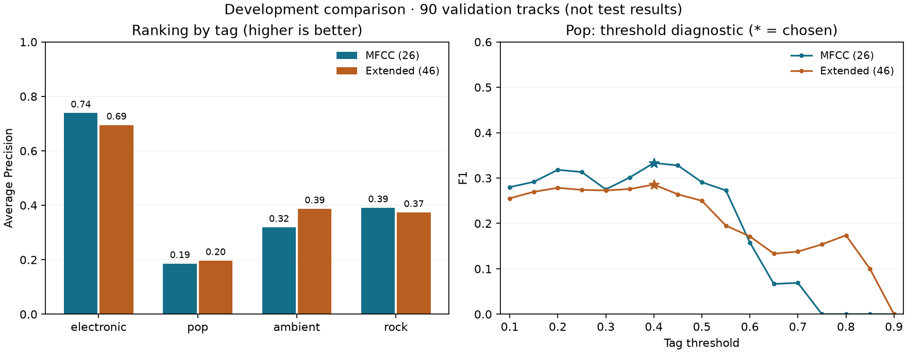

# Validation-only feature comparison

Run date: 2026-08-28.

Historical exact-source-tag experiment. Its 300/90 development split and validation-tuned thresholds differ from the expanded broad-label comparisons in [README.md](README.md#model-development-path).

## Scope

One fixed comparison: 300 training tracks and 90 validation tracks; artist IDs are separated.
The original baseline test results were already known. No test audio was read or predicted in this experiment.
This is exploratory development evidence, not a new blind test. The default model and original results are unchanged.
See the [pre-run protocol](experiments/PROTOCOL.md) and [frozen plan](experiments/feature_comparison_plan.json).

## Measured comparison

| Input | Features | Validation Macro AP (primary) | Validation Macro-F1 | Validation Micro-F1 |
| --- | ---: | ---: | ---: | ---: |
| MFCC statistics | 26 | 0.4085 | 0.4894 | 0.5260 |
| MFCC + spectral/onset/chroma statistics | 46 | 0.4127 | 0.4556 | 0.5098 |

Macro AP changed by +0.0043; Macro-F1 changed by -0.0337.
AP evaluates ranking without choosing a tag cutoff. F1 combines precision and recall after thresholding.
Both models chose thresholds on these same validation tracks; their F1 values are optimistic development measurements.
Do not compare this table with the 90-track test scores in RESULTS.md as if the rows came from the same evaluation set.

| Tag | Positives | MFCC AP | Extended AP | MFCC F1 | Extended F1 |
| --- | ---: | ---: | ---: | ---: | ---: |
| electronic | 46 | 0.7388 | 0.6945 | 0.6829 | 0.6870 |
| pop | 16 | 0.1856 | 0.1965 | 0.3333 | 0.2857 |
| ambient | 18 | 0.3189 | 0.3866 | 0.4412 | 0.4444 |
| rock | 17 | 0.3906 | 0.3732 | 0.5000 | 0.4054 |



## Thresholds and errors

TP: predicted and annotated positive; FP: predicted positive but unannotated; FN: annotated positive but missed; TN: neither.
These counts are relative to dataset annotations, which may be incomplete.

| Input | Tag | Selected threshold | TP | FP | FN | TN |
| --- | --- | ---: | ---: | ---: | ---: | ---: |
| mfcc | electronic | 0.30 | 42 | 35 | 4 | 9 |
| mfcc | pop | 0.40 | 11 | 39 | 5 | 35 |
| mfcc | ambient | 0.20 | 15 | 35 | 3 | 37 |
| mfcc | rock | 0.70 | 8 | 7 | 9 | 66 |
| extended | electronic | 0.10 | 45 | 40 | 1 | 4 |
| extended | pop | 0.40 | 8 | 32 | 8 | 42 |
| extended | ambient | 0.60 | 10 | 17 | 8 | 55 |
| extended | rock | 0.20 | 15 | 42 | 2 | 31 |

With every threshold fixed at 0.5 (a diagnostic, not a new model):

| Input | Validation Macro-F1 | Validation Micro-F1 |
| --- | ---: | ---: |
| mfcc | 0.3992 | 0.4327 |
| extended | 0.3936 | 0.4242 |

Lowering a fixed tag's threshold can add both true positives and false positives; it does not retrain the classifier.
The grid searches tag F1, not a requirement for high precision. A threshold below 0.5 is not itself a bug.

## Two baseline validation error cases

Selected by descending number of mismatched tags, then track ID. No auditory cause has been established.

### track_0040302

[Original track](http://www.jamendo.com/track/40302); validation partition.
Dataset target tags: rock. Predicted: electronic, pop, ambient.

| Tag | Annotated | Score | Threshold | Selected |
| --- | --- | ---: | ---: | --- |
| electronic | False | 0.3282 | 0.30 | True |
| pop | False | 0.5402 | 0.40 | True |
| ambient | False | 0.3197 | 0.20 | True |
| rock | True | 0.3694 | 0.70 | False |

### track_0153403

[Original track](http://www.jamendo.com/track/153403); validation partition.
Dataset target tags: electronic. Predicted: pop, ambient, rock.

| Tag | Annotated | Score | Threshold | Selected |
| --- | --- | ---: | ---: | --- |
| electronic | True | 0.1966 | 0.30 | False |
| pop | False | 0.9078 | 0.40 | True |
| ambient | False | 0.7489 | 0.20 | True |
| rock | False | 0.9276 | 0.70 | True |

## Decision and limits

The predeclared primary metric increased slightly, while both F1 averages decreased. There is no consistent improvement across metrics or tags.
Keep the simpler 26-feature baseline as the default demo, as planned; retain the candidate and this mixed result as a documented comparison.
This is a simplicity/development decision, not a claim that MFCC wins the primary metric or that either method is statistically superior.
No confidence interval or significance claim is made. The validation set is small, coverage-enriched and reused for threshold selection.
Possible limitations include lost time order, redundant descriptors, key-sensitive chroma and noisy track-level labels. This experiment does not isolate their causal contributions.
Adding these descriptors does not provide tempo estimation, chord recognition, or a full description of rhythm and harmony.
No additional hyperparameter search or test-set evaluation was performed. The experiment stops after this fixed comparison.

## Reproduce locally

```bash
.venv/bin/python compare_features.py
.venv/bin/python report_comparison.py
```

Requires the original local baseline artifacts and prepared audio. No new packages or data downloads are required in the existing environment.
Raw metrics (`outputs/feature_comparison/metrics.json`, generated locally) · MFCC predictions (`outputs/feature_comparison/mfcc_validation_predictions.csv`, generated locally) · Extended predictions (`outputs/feature_comparison/extended_validation_predictions.csv`, generated locally)

[Metric definitions: F1](https://scikit-learn.org/stable/modules/generated/sklearn.metrics.f1_score.html) and [Average Precision](https://scikit-learn.org/stable/modules/generated/sklearn.metrics.average_precision_score.html).
