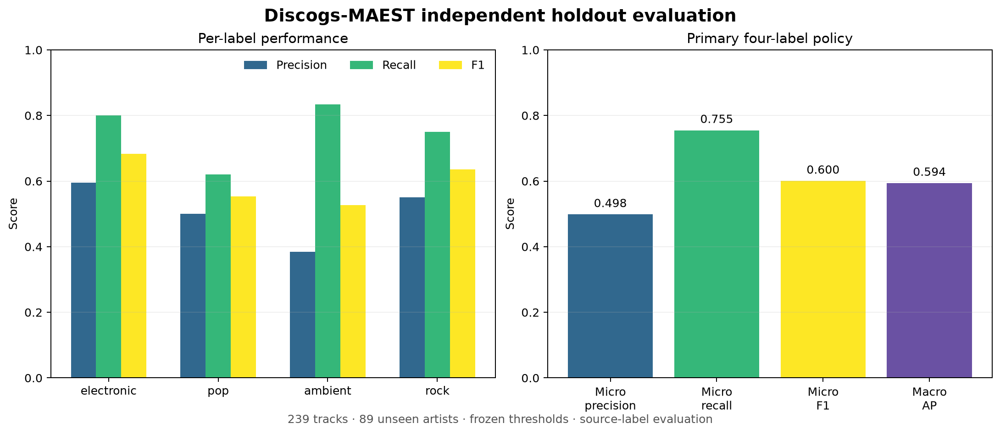
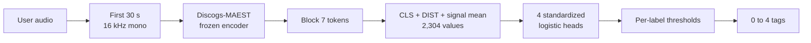

# Multi-label Music Tagging with Discogs-MAEST

An academic music-information-retrieval portfolio project that tags the first
30 seconds of an audio file as any combination of **electronic**, **pop**,
**ambient**, and **rock**. The final system uses a frozen pretrained
Discogs-MAEST encoder and four locally trained logistic-regression heads.

The project began with a 26-feature MFCC baseline, compared frozen music
representations in separately documented development stages, and finished
with a one-time artist-disjoint holdout evaluation. It is a research
prototype with an honest error analysis, not a claim of production accuracy.

**Author:** Chenglin Song（宋承麟）



## What the project demonstrates

- multi-label prediction: a track may receive several tags or no tag;
- audio preprocessing and frozen representation extraction;
- artist-disjoint development and evaluation to reduce identity leakage;
- validation-only model and threshold selection;
- a final 239-track holdout opened only after the protocol was frozen;
- quantitative evaluation plus a separately frozen listening review;
- a local command that accepts a user's WAV, FLAC, OGG, or supported MP3 file.

## Try the final model

The following setup was tested on Apple Silicon macOS with Python 3.13.15.
The first run downloads approximately 348 MB of pinned MAEST files from the
official MTG-UPF Hugging Face repository. Dependency installation requires
additional disk space. The input must be at least 30 seconds long.

```bash
python3 -m venv .venv-demo
.venv-demo/bin/python -m pip install --upgrade pip
.venv-demo/bin/python -m pip install -r requirements-demo.txt
.venv-demo/bin/python prepare_maest_hf.py
.venv-demo/bin/python predict_maest.py data/previews/track_0207501_30s.wav
```

The included 30-second CC BY 3.0 excerpt provides a reproducible first check.
To analyze another track, replace that path with your own audio file.

On Apple Silicon, `--device mps` may accelerate feature extraction:

```bash
.venv-demo/bin/python predict_maest.py "path/to/your_music.mp3" --device mps
```

The output is JSON so it can be read directly or consumed by another program:

```json
{
  "predicted_tags": ["rock"],
  "scores": [
    {"label": "electronic", "score": 0.0699, "threshold": 0.4, "selected": false},
    {"label": "pop", "score": 0.2483, "threshold": 0.275, "selected": false},
    {"label": "ambient", "score": 0.0301, "threshold": 0.375, "selected": false},
    {"label": "rock", "score": 0.6237, "threshold": 0.275, "selected": true}
  ]
}
```

Scores are classifier outputs, not calibrated confidence percentages. Only
the first 30 seconds are analyzed. Missing, corrupt, shorter-than-30-second,
silent, and non-finite inputs are rejected.

## System design



The public classifier artifact is a 221 KB NumPy array plus JSON metadata. It
contains only scaler parameters, linear coefficients, intercepts, thresholds,
and provenance. It is loaded with `allow_pickle=False`; users do not need to
retrain the heads. Pretrained MAEST weights and source audio are not included.

The seventh-block CLS/DIST/signal-mean representation follows the
[MAEST authors' extraction example](https://github.com/palonso/MAEST#using-maest-in-your-code);
it was fixed before this project's MAEST evaluation, not selected by a local
layer or pooling search. The [design rationale](docs/DESIGN_RATIONALE.md)
explains this choice, the linear heads, metrics, artist grouping, background
tracks, and the limits of the evaluation.

## Data and experimental boundary

The source is the [MTG-Jamendo Dataset](https://github.com/MTG/mtg-jamendo-dataset).
The four broad targets preserve its multi-label annotations and conservatively
map declared subgenres such as `techno`, `synthpop`, and `hardrock` to their
parent labels.

The final experiment used:

| Role | Tracks | Purpose |
| --- | ---: | --- |
| Training | 903 | Fit development candidates |
| Development validation | 303 | Compare frozen representations and policies |
| Final fit | 1,206 | Refit the selected heads before holdout scoring |
| Independent holdout | 239 | One-time evaluation on 89 unseen artists |
| Historical test excluded | 90 | Kept out because earlier results were already observed |

No artist appears in both the final-fit and holdout partitions. The subset is
purposefully enriched for the four targets and is not the official benchmark
distribution. Full provenance, acquisition checks, label mapping, and license
information for the original subset are in [data/DATASET.md](data/DATASET.md).
The [expansion protocol](experiments/DATA_EXPANSION_PROTOCOL.md) and
[broad-label protocol](experiments/EXPANDED_MODEL_PROTOCOL.md) document the
larger subset and the target mapping used by the final model.

## Results

The primary policy returned all four possible labels independently:

| Label | Precision | Recall | F1 | Average precision |
| --- | ---: | ---: | ---: | ---: |
| electronic | 0.596 | 0.800 | 0.683 | 0.749 |
| pop | 0.500 | 0.620 | 0.554 | 0.506 |
| ambient | 0.385 | 0.833 | 0.526 | 0.444 |
| rock | 0.551 | 0.750 | 0.635 | 0.676 |
| **Overall** | **0.498 micro** | **0.755 micro** | **0.600 micro** | **0.594 macro** |

Output coverage was 206/239 tracks (86.2%). Bootstrap intervals and the
secondary selective-policy results are reported in
[FINAL_RESULTS.md](FINAL_RESULTS.md). The predeclared 80% four-label precision
goal was not met; this result was retained rather than tuning on the holdout.

### Perceptual check

A separate set of 40 label-and-audio questions was frozen before final scoring.
Four answers were uncertain. Across the remaining 36, the model agreed with
the reviewer on 29 (80.6%); descriptive precision against that single reviewer
was 76.5%. This small balanced audit helps diagnose missing or
segment-mismatched source tags, but it does not replace the 239-track formal
result. See [BLIND_REVIEW_RESULTS.md](BLIND_REVIEW_RESULTS.md).

## Model-development path

These are two different development tasks. Compare rows **within** a table;
differences **between** tables do not isolate an improvement from the encoder,
because the data, label definition, and selection procedure also changed.

### Early comparison: 300 training / 90 validation tracks, exact source tags

Both rows use the same tracks, three artist-grouped training folds, six
logistic settings, and thresholds selected on training out-of-fold (OOF)
predictions. A target is positive only when its exact tag occurs in the source
annotations; there is no broad-subgenre mapping in this stage.

| Representation | Validation micro-F1 | Validation macro AP | Report |
| --- | ---: | ---: | --- |
| MFCC + selected head | 0.517 | 0.424 | [MFCC vs MERT](MERT_RESULTS.md) |
| MERT-v0 + selected head | 0.563 | 0.533 | [MFCC vs MERT](MERT_RESULTS.md) |

This MFCC row is the later CV-selected head, not the original default baseline
with validation-tuned thresholds. The original baseline's separate 90-track
historical **test** result is micro-F1 0.480 and macro AP 0.451 in
[RESULTS.md](RESULTS.md); that test set is not the 90-track validation set above.

### Expanded comparison: 903 training / 303 validation tracks, broad labels

All three rows use the same expanded tracks, broad-subgenre mapping, five
artist-grouped training folds, six logistic settings, and training-OOF threshold
rules. MERT layers are selected inside training CV; MAEST uses one fixed
official representation. These are development comparisons of the declared
pipelines, not a claim that every encoder had an identical representation search.

| Representation | Validation micro-F1 | Validation macro AP | Report |
| --- | ---: | ---: | --- |
| MERT-v0 | 0.502 | 0.524 | [Expanded development](EXPANDED_RESULTS.md) |
| MERT-v1 | 0.517 | 0.535 | [MERT-v1](MERT_V1_RESULTS.md) |
| Discogs-MAEST | **0.578** | **0.573** | [MAEST](MAEST_RESULTS.md) |

MAEST was selected before the final 239-track holdout. None of the development
rows above is a new independent test result. The selected MAEST heads were
then refitted on all 1,206 development tracks for the separately reported
[final evaluation](FINAL_RESULTS.md).

The original baseline summarizes 13 MFCCs over time with a mean and standard
deviation, producing 26 features. Later experiments keep the linear heads but
replace handcrafted features with frozen pretrained music representations.
The earlier [handcrafted-feature comparison](EXPERIMENTS.md) and
[MFCC diagnostic](IMPROVEMENT.md) retain their original experimental scope.

## Repository guide

| Path | Purpose |
| --- | --- |
| `predict_maest.py` | Final user-audio command |
| `artifacts/` | Safe final linear-head parameters and provenance |
| `prepare_maest_hf.py` | Pinned, checksum-verified upstream model retrieval |
| `maest_hf_features.py` | Reviewed audio and MAEST feature extraction |
| `train.py`, `features.py`, `predict.py` | Original MFCC baseline |
| `experiments/` | Frozen protocols and model-selection records |
| `tests/` | Synthetic numerical, split-integrity, and input checks |
| `FINAL_RESULTS.md` | Formal holdout report |
| `docs/DESIGN_RATIONALE.md` | Design choices, evidence, and limits |
| `docs/ROADMAP.md` | Completed documentation fixes and planned improvements |
| `docs/assets/` | Published report figures and their provenance |

Development scripts and intermediate reports are retained to show how the
final decision was reached. Downloaded audio, pretrained weights, feature
caches, predictions, virtual environments, and local joblib files are ignored
by Git.

<details>
<summary><strong>Full research reproduction commands</strong></summary>

## Reproduce the research pipeline

The compact demo above is the recommended way to try the project. Full
reproduction is heavier and uses the pinned research environment:

```bash
python3 -m venv .venv-improve
.venv-improve/bin/python -m pip install -r requirements-mert-lock.txt
```

### Original frozen MFCC subset

```bash
.venv-improve/bin/python prepare_dataset.py download --workers 8
.venv-improve/bin/python audit_dataset.py
.venv-improve/bin/python train.py
.venv-improve/bin/python report_results.py
```

### Expanded MAEST development experiment

```bash
.venv-improve/bin/python prepare_expansion.py download-development --workers 8
.venv-improve/bin/python prepare_expansion.py verify-development
.venv-improve/bin/python prepare_maest_hf.py
.venv-improve/bin/python extract_expanded_maest_hf.py pilot
.venv-improve/bin/python extract_expanded_maest_hf.py extract
.venv-improve/bin/python expanded_maest_hf.py run
```

### Frozen final holdout

The final plan is already frozen; do not run its `freeze` command again.

```bash
.venv-improve/bin/python prepare_holdout.py download --workers 8
.venv-improve/bin/python prepare_holdout.py verify
.venv-improve/bin/python extract_holdout_maest_hf.py --device cpu
.venv-improve/bin/python final_maest_holdout.py run
.venv-improve/bin/python report_blind_review.py
```

Exact experimental rules are in
[experiments/FINAL_HOLDOUT_PROTOCOL.md](experiments/FINAL_HOLDOUT_PROTOCOL.md).

</details>

## Tests

The suite uses synthetic signals and temporary files; it does not fabricate
training examples or reported metrics.

```bash
.venv-improve/bin/python -m unittest discover -s tests -v
```

The local release candidate passes 48 tests. The packaged classifier was also
compared with the archived sklearn bundle on all 239 holdout feature vectors;
all threshold decisions matched.

## Limitations

- Genre boundaries are subjective and tracks can legitimately span labels.
- Source tags may be incomplete or may not describe the opening 30 seconds.
- Ambient and pop remain the weakest targets under source-label evaluation.
- The subset is small relative to modern production music catalogs.
- MAEST pretraining overlap with MTG-Jamendo cannot be audited from the public
  metadata available to this project.
- The exact upstream 519-label model repository does not state a weight
  license, so this project retrieves pinned files from the official source and
  does not redistribute them.
- Only Apple Silicon macOS and the recorded dependency versions have been
  tested; other platforms are not claimed to work without verification.

## Development responsibility

Chenglin Song defined the portfolio goal and label scope, made all subjective
listening-review decisions, tested the command on external audio, studied the
evaluation concepts, and approved the final interpretation. Generative-AI
tools supported code drafting and refactoring, debugging, test design, and
English editing. Reported metrics come from the documented executable pipeline;
no synthetic labels, audio, or results were used. See
[AI_ASSISTANCE.md](AI_ASSISTANCE.md) for the exact division of work.

## Licenses and attribution

Project-owned source code is released under the [MIT License](LICENSE). The
packaged final classifier heads are separately licensed under
[CC BY-NC 4.0](MODEL_LICENSE.md). MTG-Jamendo metadata, individual recordings,
pretrained encoders, and Python dependencies keep their own terms. One
attributed CC BY 3.0 demonstration excerpt is included; no training or
evaluation audio and no pretrained encoder weight is included. See
[THIRD_PARTY_NOTICES.md](THIRD_PARTY_NOTICES.md) for the complete boundary.
