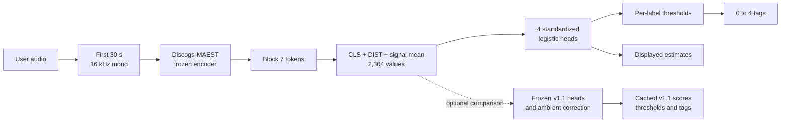
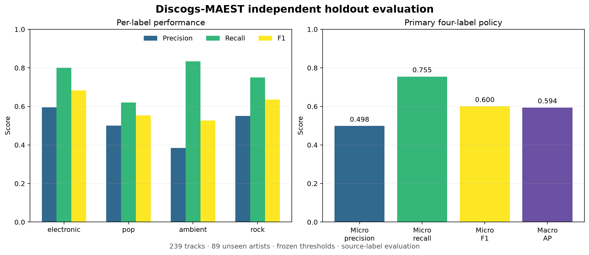

# Multi-label Music Tagging with Discogs-MAEST

An academic music-information-retrieval portfolio project that tags the first
30 seconds of an audio file as any combination of **electronic**, **pop**,
**ambient**, and **rock**. The final system uses a frozen pretrained
Discogs-MAEST encoder and four locally trained logistic-regression heads.

The project began with a 26-feature MFCC baseline and compared frozen music
representations in separately documented development stages. The original
v1.0 evaluation used a 239-track holdout; the current v1.2 application was
subsequently confirmed on 372 new project tracks. Those studies are reported
separately below. This is a research prototype with documented limitations.

**Author:** Chenglin Song（宋承麟）

[Windows installer](https://github.com/f0rKyrie1rving/music-classification/releases/tag/v1.2.0)
· [Current v1.2 results](#current-v12-results)
· [Separate calibration research](https://github.com/f0rKyrie1rving/music-probability-calibration)
· [Bilingual preprint](https://github.com/f0rKyrie1rving/music-probability-calibration/blob/main/paper/README.md)

## Current v1.2 results

The fixed v1.2 candidate was compared with the actual v1.1 application on
**372 tracks from 250 artist IDs absent from the documented project history**. Pop/ambient
false-positive cases fell from **152 to 124**, while missed focus labels
increased from **59 to 61**. Four-label micro F1 rose from **0.620 to 0.637**.
These are results against same-source dataset tags, not listener-confirmed
accuracy on arbitrary music. See the
[372-track confirmation report](docs/application_candidate_validation/SUMMARY_ZH.md)
and [application integration record](docs/APPLICATION_V1_2.md).

The separate calibration study asks whether the displayed probabilities are
reliable. Its methods and preprint are linked above; its conclusions do not
replace this application's validation results. The 239-track results farther
down this page describe the historical v1.0 model.

## Windows desktop app

For a reviewer-friendly demonstration, download the
[v1.2.0 Windows installer](https://github.com/f0rKyrie1rving/music-classification/releases/download/v1.2.0/MusicClassification-Setup-1.2.0-win64.exe)
from the public [v1.2.0 release](https://github.com/f0rKyrie1rving/music-classification/releases/tag/v1.2.0).
Under **Assets**, choose the `.exe` installer. GitHub's **Source code (zip)**,
**Source code (tar.gz)**, and **Code → Download ZIP** contain source files, not
an installable app. Release downloads do not require GitHub sign-in and are
separate from the temporary 14-day workflow artifacts.
The 64-bit, per-user installer targets Windows 10 version 1809 or newer and
does not require Python, Git, administrator access, or a terminal. The app
provides an audio picker, an included attributed example, and a four-label
score-and-threshold table.

The first analysis downloads approximately 348 MB of pinned Discogs-MAEST
files from the official MTG-UPF Hugging Face repository and verifies every
file. The installer excludes those third-party weights because the exact model
card does not declare their license. Internet access to Hugging Face is required
for this first download. To uninstall, use **Settings → Apps → Installed apps**
(Windows 11) or **Apps & features** (Windows 10), then select
**Music Tagging Demo → Uninstall**; the uninstaller also removes
the downloaded model and app cache, without touching audio selected elsewhere.

See the [Windows installation, download verification, and uninstall guide](docs/WINDOWS_INSTALLER.md).
The installer is produced on a real Windows runner and must pass unit tests plus
packaged end-to-end inference and an install/uninstall cleanup check before a
tagged release is published. This academic portfolio release is **unsigned**:
Windows may display an unknown-publisher or SmartScreen warning, and managed
university computers may block it. No security-setting changes are required or
recommended by this project. Reviewers can also view the results and figures
in this README without installing anything.

The current source version is **1.2.0**. The desktop app and
`application_predict.py` use the exact candidate that passed the 372-song
confirmation. **Compare v1.1** shows the previous application's scores,
thresholds and selected tags using the same audio features. See the
[v1.2 integration record](docs/APPLICATION_V1_2.md) for checks and release status.
The [v1.2.0 release build](https://github.com/f0rKyrie1rving/music-classification/actions/runs/36512571056)
passed all 215 tests, packaged and installed audio inference, installation and
uninstall checks before publication on 2026-09-29. See the
[publication receipt](docs/application_integration/release_publication.json).

The retained v1.1 comparator corrects the ambient score's training class-weight
offset. Its original interface offered **Compare original scores**.
On two previously observed cohorts, macro Brier decreased by 6.13% and 6.57%, with
every selected tag unchanged. These are probability-error reductions, not accuracy
increases or new independent validation. See [the v1.1 evaluation](docs/APPLICATION_V1_1.md).
The subsequent fixed check on 204 new project tracks from 150 artists found only
a **0.67%** reduction, with a paired artist interval spanning zero. It did **not**
meet the prespecified acceptance gate; the correction remains experimental.
Twenty-eight selected tracks were unavailable because of DNS failures and were
retained in the failure record. See [the new-song validation](docs/application_fresh_validation/SUMMARY_ZH.md).
The [pop/ambient error audit](docs/application_fp_audit/SUMMARY_ZH.md) found no
evidence of failed downloads entering the scored data; listening adjudication
of the source-label disagreements remains pending.
An [automatic development experiment](docs/application_auto_improvement/SUMMARY_ZH.md)
then tested pop/ambient head and threshold changes without listening labels.
Grouped development false positives fell 4.87%, but missed labels increased and
micro F1 declined slightly. The candidate failed its fixed development gate;
the application was not replaced and no new-song confirmation was launched.
A later [factorial development study](docs/application_factorial/SUMMARY_ZH.md)
separated classifier and threshold changes on an explicitly retired, expanded
1,915-track development pool. The fixed combined procedure reduced focus-label
false positives by 10.18% and raised micro F1 from 0.605109 to 0.613212, narrowly
passing its development gate. Learning curves supported more training data in
the pooled sample, with source-level exceptions. That study compared refitted
recipes, not final application artifacts; it did not acquire a new-song cohort.
A [fixed candidate](docs/application_candidate/SUMMARY_ZH.md) was built
separately: pop/ambient heads trained on all 1,915 development tracks, with the
actual application's electronic/rock heads preserved. Its parameters, thresholds
and audio inference have been verified. Its subsequent [fixed new-song
confirmation](docs/application_candidate_validation/SUMMARY_ZH.md) covered all
372 selected tracks from 250 new documented-project artist IDs, with no missing
audio or features. Against the actual v1.1 application, pop/ambient false-positive
cases fell from 152 to 124 (**18.42%**), while missed focus labels rose from 59 to
61. Micro F1 increased from 0.619910 to 0.637002, and macro Brier decreased by
2.72%. The fixed coverage, point-estimate and paired artist-interval gates passed;
independent reconstruction confirmed the result. Following that confirmation,
those unchanged weights were integrated into v1.2. These remain
same-source/proxy-label results, not human-confirmed accuracy on arbitrary music.
The original v1.0/v1.1 models, predictors and historical results are retained. A source
version change alone does not publish a new Windows installer; use the version
shown on the downloaded release asset.

## What the project demonstrates

- multi-label prediction: a track may receive several tags or no tag;
- audio preprocessing and frozen representation extraction;
- artist-disjoint development and evaluation to reduce identity leakage;
- validation-only model and threshold selection;
- a historical v1.0 239-track holdout, with prior exposure disclosed, and a later fixed 372-track confirmation of v1.2;
- quantitative evaluation plus a separately frozen listening review;
- a local command that accepts a user's WAV, FLAC, OGG, or supported MP3 file.

## Try the current model from source

The following setup was tested on Apple Silicon macOS with Python 3.13.15.
The first run downloads approximately 348 MB of pinned MAEST files from the
official MTG-UPF Hugging Face repository. Dependency installation requires
additional disk space. The input must be at least 30 seconds long.

```bash
python3 -m venv .venv-demo
.venv-demo/bin/python -m pip install --upgrade pip
.venv-demo/bin/python -m pip install -r requirements-demo.txt
.venv-demo/bin/python prepare_maest_hf.py
.venv-demo/bin/python application_predict.py data/previews/track_0207501_30s.wav
```

The included 30-second CC BY 3.0 excerpt provides a reproducible first check.
To analyze another track, replace that path with your own audio file.

On Apple Silicon, `--device mps` may accelerate feature extraction:

```bash
.venv-demo/bin/python application_predict.py "path/to/your_music.mp3" --device mps
```

Windows source-code users can open PowerShell in the repository and use the
desktop entry point. This separate downloader is implemented with Python's
standard library and leaves the frozen research acquisition scripts unchanged:

```powershell
py -3.12 -m venv .venv-demo
.venv-demo\Scripts\python.exe -m pip install --upgrade pip
.venv-demo\Scripts\python.exe -m pip install -r requirements-demo.txt
.venv-demo\Scripts\python.exe desktop_app.py
```

The final command-line interface is also available on Windows. Use the
Windows-compatible verified downloader once, then run the same predictor:

```powershell
.venv-demo\Scripts\python.exe prepare_maest_windows.py
.venv-demo\Scripts\python.exe application_predict.py data\previews\track_0207501_30s.wav
```

The output is JSON so it can be read directly or consumed by another program:

```json
{
  "application_version": "1.2.0",
  "predicted_tags": ["pop", "rock"],
  "score_mode": "validated_candidate",
  "scores": [
    {"label": "electronic", "score": 0.0699, "threshold": 0.4, "selected": false},
    {"label": "pop", "score": 0.3219, "threshold": 0.275, "selected": true},
    {"label": "ambient", "score": 0.0272, "threshold": 0.2, "selected": false},
    {"label": "rock", "score": 0.6237, "threshold": 0.275, "selected": true}
  ]
}
```

The JSON also includes the model identity, validation receipt, `raw_score` and
`raw_threshold`. Decisions use the candidate's unrounded scores and thresholds;
the old ambient correction is not applied to its new unweighted classifier.
The included example reproduces `pop` and `rock` in v1.2, versus only `rock` in
v1.1; this is a reproducibility check, not a human-certified genre annotation.
Pass `--compare-baseline` to include v1.1 scores and tags from the same feature
vector. `predict_app.py` and `predict_maest.py` remain the frozen v1.1 and v1.0
interfaces. Estimates can still be wrong and are not guaranteed confidence
percentages. Only the first 30 seconds are analyzed.
Missing, corrupt, shorter-than-30-second,
silent, and non-finite inputs are rejected.

## System design


```mermaid
flowchart LR
    A[User audio] --> B[First 30 s<br/>16 kHz mono]
    B --> C[Discogs-MAEST<br/>frozen encoder]
    C --> D[Block 7 tokens]
    D --> E[CLS + DIST + signal mean<br/>2,304 values]
    E --> F[4 standardized<br/>logistic heads]
    F --> G[Per-label thresholds]
    G --> H[0 to 4 tags]
    F --> J[Displayed estimates]
    E -. optional comparison .-> K[Frozen v1.1 heads<br/>and ambient correction]
    K --> L[Cached v1.1 scores<br/>thresholds and tags]
```

The current classifier is a NumPy NPZ plus JSON metadata and provenance receipts.
It contains scaler parameters, linear coefficients, intercepts and thresholds;
the original 221 KB v1.0/v1.1 array is also retained for comparison. Parameters
are loaded with `allow_pickle=False`; users do not need to
retrain the heads. Pretrained MAEST weights and source audio are not included.

The seventh-block CLS/DIST/signal-mean representation follows the
[MAEST authors' extraction example](https://github.com/palonso/MAEST#using-maest-in-your-code);
it was fixed before this project's MAEST evaluation, not selected by a local
layer or pooling search. The [design rationale](docs/DESIGN_RATIONALE.md)
explains this choice, the linear heads, metrics, artist grouping, background
tracks, and the limits of the evaluation.

## Historical v1.0 data and experimental boundary

The source is the [MTG-Jamendo Dataset](https://github.com/MTG/mtg-jamendo-dataset).
The four broad targets preserve its multi-label annotations and conservatively
map declared subgenres such as `techno`, `synthpop`, and `hardrock` to their
parent labels.

The original v1.0 experiment used:

| Role | Tracks | Purpose |
| --- | ---: | --- |
| Training | 903 | Fit development candidates |
| Development validation | 303 | Compare frozen representations and policies |
| Final fit | 1,206 | Refit the selected heads before holdout scoring |
| Final holdout | 239 | Evaluation on 89 artists excluded from final fitting |
| Historical test excluded | 90 | Kept out because earlier results were already observed |

No artist appears in both the final-fit and holdout partitions. The subset is
purposefully enriched for the four targets and is not the official benchmark
distribution. Full provenance, acquisition checks, label mapping, and license
information for the original subset are in [data/DATASET.md](data/DATASET.md).
The [expansion protocol](experiments/DATA_EXPANSION_PROTOCOL.md) and
[broad-label protocol](experiments/EXPANDED_MODEL_PROTOCOL.md) document the
larger subset and the target mapping used by the final model.

Of the 89 holdout artists, 40 also appeared in the previously observed historical
test, accounting for 150 holdout tracks. One holdout track, `track_0543400`, had
already been used as a learning/decoding sample. Thus this is artist-disjoint
from final fitting, but not wholly unobserved across the project's history.
The original 239-track results are retained; exclusions of that sample/artist
and artist-cluster uncertainty are reported as post-hoc checks in
[the evaluation review supplement](EVALUATION_REVIEW.md).

## Historical v1.0 results



These results describe the original 239-track holdout, not the current v1.2
application. The [current confirmation](#current-v12-results) used a different
cohort and a direct v1.1 comparator; scores across the two cohorts should not
be treated as a controlled estimate of improvement.

The primary policy returned all four possible labels independently:

| Label | Precision | Recall | F1 | Average precision |
| --- | ---: | ---: | ---: | ---: |
| electronic | 0.596 | 0.800 | 0.683 | 0.749 |
| pop | 0.500 | 0.620 | 0.554 | 0.506 |
| ambient | 0.385 | 0.833 | 0.526 | 0.444 |
| rock | 0.551 | 0.750 | 0.635 | 0.676 |
| **Overall** | **0.498 micro** | **0.755 micro** | **0.600 micro** | **0.594 macro** |

Output coverage was 206/239 tracks (86.2%). Bootstrap intervals and the
secondary selective-policy results are reported in
[FINAL_RESULTS.md](FINAL_RESULTS.md). The predeclared 80% four-label precision
goal was not met; this result was retained rather than tuning on the holdout.

### Perceptual check

A separate set of 40 label-and-audio questions was frozen before final scoring.
Four answers were uncertain. Across the remaining 36, the model agreed with
the reviewer on 29 (80.6%); descriptive precision against that single reviewer
was 76.5%. This small balanced audit helps diagnose missing or
segment-mismatched source tags, but it does not replace the 239-track formal
result. Questions followed a predictable source-positive/source-negative order,
so source targets were hidden on screen but potentially inferable from order.
See [BLIND_REVIEW_RESULTS.md](BLIND_REVIEW_RESULTS.md).

## Model-development path

These are two different development tasks. Compare rows **within** a table;
differences **between** tables do not isolate an improvement from the encoder,
because the data, label definition, and selection procedure also changed.

### Early comparison: 300 training / 90 validation tracks, exact source tags

Both rows use the same tracks, three artist-grouped training folds, six
logistic settings, and thresholds selected on training out-of-fold (OOF)
predictions. A target is positive only when its exact tag occurs in the source
annotations; there is no broad-subgenre mapping in this stage.

| Representation | Validation micro-F1 | Validation macro AP | Report |
| --- | ---: | ---: | --- |
| MFCC + selected head | 0.517 | 0.424 | [MFCC vs MERT](MERT_RESULTS.md) |
| MERT-v0 + selected head | 0.563 | 0.533 | [MFCC vs MERT](MERT_RESULTS.md) |

This MFCC row is the later CV-selected head, not the original default baseline
with validation-tuned thresholds. The original baseline's separate 90-track
historical **test** result is micro-F1 0.480 and macro AP 0.451 in
[RESULTS.md](RESULTS.md); that test set is not the 90-track validation set above.

### Expanded comparison: 903 training / 303 validation tracks, broad labels

All three rows use the same expanded tracks, broad-subgenre mapping, five
artist-grouped training folds, six logistic settings, and training-OOF threshold
rules. MERT layers are selected inside training CV; MAEST uses one fixed
official representation. These are development comparisons of the declared
pipelines, not a claim that every encoder had an identical representation search.

| Representation | Validation micro-F1 | Validation macro AP | Report |
| --- | ---: | ---: | --- |
| MERT-v0 | 0.502 | 0.524 | [Expanded development](EXPANDED_RESULTS.md) |
| MERT-v1 | 0.517 | 0.535 | [MERT-v1](MERT_V1_RESULTS.md) |
| Discogs-MAEST | **0.578** | **0.573** | [MAEST](MAEST_RESULTS.md) |

MAEST was selected before the final 239-track holdout. None of the development
rows above is a new independent test result. The selected MAEST heads were
then refitted on all 1,206 development tracks for the separately reported
[final evaluation](FINAL_RESULTS.md).

The original baseline summarizes 13 MFCCs over time with a mean and standard
deviation, producing 26 features. Later experiments keep the linear heads but
replace handcrafted features with frozen pretrained music representations.
The earlier [handcrafted-feature comparison](EXPERIMENTS.md) and
[MFCC diagnostic](IMPROVEMENT.md) retain their original experimental scope.

## Repository guide

| Path | Purpose |
| --- | --- |
| `application_predict.py`, `application_release.py` | Current v1.2 user-audio command and pinned release identity |
| `artifacts/application_release.json` | Binds the application to the unchanged candidate and its confirmation records |
| `predict_app.py`, `score_correction.py` | Retained v1.1 comparator and score correction |
| `predict_maest.py` | Retained v1.0 user-audio command |
| `evaluate_application_correction.py` | Reproduce the v1.1 probability comparison from published values |
| `desktop_app.py` | Reviewer-friendly desktop interface and release smoke test |
| `desktop_runtime.py` | Cross-platform, resumable, checksum-verified desktop model download |
| `prepare_maest_windows.py` | Windows-compatible source checkout model preparation |
| `artifacts/` | Safe final linear-head parameters and provenance |
| `prepare_maest_hf.py` | Pinned, checksum-verified upstream model retrieval |
| `maest_hf_features.py` | Reviewed audio and MAEST feature extraction |
| `packaging/windows/` | PyInstaller and Inno Setup release definitions |
| `.github/workflows/windows-installer.yml` | Windows build, inference check, installer and Release automation |
| `train.py`, `features.py`, `predict.py` | Original MFCC baseline |
| `experiments/` | Frozen protocols and model-selection records |
| `tests/` | Synthetic numerical, split-integrity, and input checks |
| `FINAL_RESULTS.md` | Formal holdout report |
| `docs/DESIGN_RATIONALE.md` | Design choices, evidence, and limits |
| `docs/ROADMAP.md` | Completed documentation fixes and planned improvements |
| `docs/assets/` | Published report figures and their provenance |

Development scripts and intermediate reports are retained to show how the
final decision was reached. Downloaded audio, pretrained weights, feature
caches, working predictions, virtual environments, and local joblib files are
ignored by Git. A compact [evaluation package](data/evaluation/README.md)
publishes all 239 sets of targets, scores and decisions, plus archived metrics.

<details>
<summary><strong>Verify historical v1.0 results and reproduce its fixed model</strong></summary>

### Recalculate historical v1.0 results (no audio or encoder required)

The following verifies both policies' complete metrics, the original bootstrap
intervals, and all listening-summary counts. It also computes the post-hoc
artist-cluster intervals and sample-exclusion sensitivities.

```bash
python3 -m venv .venv-evaluation
.venv-evaluation/bin/python -m pip install -r requirements-evaluation.txt
.venv-evaluation/bin/python evaluate_release.py --output outputs/review_audit.json
```

### Reproduce the fixed historical v1.0 model

This heavier workflow uses the published exact source pool/index snapshots and
archived manifests. It downloads the 1,206 fit and 239 holdout excerpts, verifies
their archived WAV hashes, extracts MAEST features, and refits the already
selected heads. It writes to `outputs/reproduction/`. Runtime timing is stored
separately from feature provenance. No existing final plan needs to be refrozen.

```bash
python3 -m venv .venv-improve
.venv-improve/bin/python -m pip install -r requirements-mert-lock.txt
.venv-improve/bin/python reproduce_final.py check
.venv-improve/bin/python reproduce_final.py download --workers 8
.venv-improve/bin/python prepare_maest_hf.py
.venv-improve/bin/python reproduce_final.py extract --device cpu
.venv-improve/bin/python reproduce_final.py run --device cpu
```

This replays the fixed historical v1.0 model, not every historical candidate-selection
experiment. See [reproduction scope and verification](REPRODUCTION.md), including
the distinction between clean-copy metric verification and retained-cache replay.
Historical scripts still enforce their original byte-level records, including
runtime-dependent metadata, and require retained local research inputs. Use a
separate checkout of baseline commit `68b51d5` when replaying that historical
workflow; do not refresh old plan hashes just to accept changed files.

</details>

## Tests

The suite uses synthetic signals and temporary files; it does not fabricate
training examples or reported metrics.

```bash
.venv-improve/bin/python -m unittest discover -s tests -v
```

The revised project passes the complete test suite, including listening-sheet
protection, cluster resampling, published-result checks and resumable cache
validation.
The original v1.0 packaged classifier was also
compared with the archived sklearn bundle on all 239 holdout feature vectors;
all threshold decisions matched.

## Limitations

- Genre boundaries are subjective and tracks can legitimately span labels.
- Source tags may be incomplete or may not describe the opening 30 seconds.
- Ambient and pop remain the weakest targets under source-label evaluation.
- The subset is small relative to modern production music catalogs.
- MAEST pretraining overlap with MTG-Jamendo cannot be audited from the public
  metadata available to this project.
- The exact upstream 519-label model repository does not state a weight
  license, so this project retrieves pinned files from the official source and
  does not redistribute them.
- The source command was tested directly on Apple Silicon macOS. Each published
  Windows installer must pass the Windows workflow's packaged end-to-end check,
  but the unsigned installer may still trigger an unknown-publisher warning.

## Development responsibility

Chenglin Song defined the portfolio goal and label scope, made all subjective
listening-review decisions, tested the command on external audio, studied the
evaluation concepts, and approved the final interpretation. Generative-AI
tools supported code drafting and refactoring, debugging, test design, and
English editing. Reported metrics come from the documented executable pipeline;
no synthetic labels, audio, or results were used. See
[AI_ASSISTANCE.md](AI_ASSISTANCE.md) for the exact division of work.

## Licenses and attribution

Project-owned source code is released under the [MIT License](LICENSE). The
packaged final classifier heads are separately licensed under
[CC BY-NC 4.0](MODEL_LICENSE.md). MTG-Jamendo metadata, individual recordings,
pretrained encoders, and Python dependencies keep their own terms. One
attributed CC BY 3.0 demonstration excerpt is included; no training or
evaluation audio and no pretrained encoder weight is included. See
[THIRD_PARTY_NOTICES.md](THIRD_PARTY_NOTICES.md) for the complete boundary.
