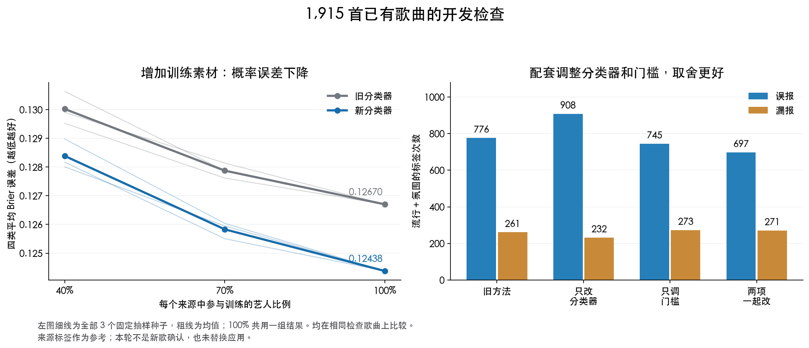

# 把分类器、门槛和训练量拆开之后，发现了什么？

2026-09-27。本轮全自动实验完成，使用 1,915 首已有歌曲、908 位艺人，不需要人工试听。

**找到了一个更有希望的组合：新的分类器配合重新选择的门槛，流行／氛围误报减少 10.18%，综合表现小幅提高，达到预先固定的开发标准。增加训练素材也改善了总体概率误差。不过，这仍是开发阶段的结果，还没有通过真正的新歌考试。**

## 用简单数字说明

“误报”是来源标签没有、模型却报了；“漏报”是来源标签有、模型却没报。按“歌曲 × 标签”计数，不代表同样数量的不同歌曲。来源标签继续作为统一参考，本轮没有人工裁决其完整性。

| 在相同检查歌曲上的设置 | 流行＋氛围误报 | 流行＋氛围漏报 | 四类综合 F1，越高越好 | 四类概率误差 Brier，越低越好 |
| --- | ---: | ---: | ---: | ---: |
| 旧分类器＋原门槛 | 776 | 261 | 0.605109 | 0.126701 |
| 只改分类器 | 908 | 232 | 0.596206 | 0.124377 |
| 只调判断门槛 | 745 | 273 | 0.605587 | 0.126701 |
| **分类器和门槛一起改：预定主方案** | **697** | **271** | **0.613212** | **0.124377** |

主方案比旧方法少 79 次误报，多 10 次漏报。综合 F1 上升约 0.0081；四类平均 Brier 误差相对下降 1.83%，log loss 相对下降 1.81%。概率误差下降不是“准确率提高了相同百分比”。

五个检查组的综合 F1 和 Brier 都改善，四个来源组的这两项指标也都改善。但只有三个检查组的两类误报降幅达到 10%，另两个为 9.03% 和 5.00%。这些分组的训练数据互相重叠，不能把五组改善当作五次独立成功。

## 为什么上次不够好，这次说明了什么？

实验把两种变化分开了，因此可以看出：

1. **只换分类器还不够。** 新分类器给出的概率总体更接近来源标签，排序指标也改善；但继续使用对应的原门槛，会把更多氛围标签报出来，合计误报反而增多。
2. **只抬门槛，收益有限。** 旧分类器单独调整门槛只少 31 次误报，同时多漏报 12 次。它改变是否贴标签，不会改变原来的概率数字，所以概率误差完全不变。
3. **新分类器需要配套门槛。** 两者组合后，误报与漏报的取舍更好。五个训练组内部都为新氛围分类器选出 0.20 的概率门槛，新流行分类器都保留原规则。它们是按提前固定的选择程序得到的，未根据外层检查答案修改。

这支持“分类器打分与贴标签规则需要配套”的解释。不能把总改善精确拆成“某百分比来自分类器、某百分比来自门槛”，因为两者存在相互影响，而且每个分类器分别在内部选择门槛。

本轮和上一轮的训练池、固定方法都不同，不能把 4.87% → 10.18% 直接解释为“单靠多加歌曲带来的提升”。下面的学习曲线才是专门控制比较方式、检查训练量的部分。

## 多给一些歌曲，是否真的有用？

在每个来源中，按固定顺序取 40%、70%、100% 的训练艺人，保留这些艺人的全部歌曲。小训练组包含在大训练组中，每次考试的歌曲完全相同。40% 和 70% 各使用三个提前固定的抽样种子，全部保留；没有挑最好的一个。

| 训练艺人比例 | 每次实际训练歌曲数 | 旧分类器平均 Brier | 新分类器平均 Brier |
| --- | ---: | ---: | ---: |
| 40% | 578–662 | 0.130024 | 0.128388 |
| 70% | 1,048–1,113 | 0.127875 | 0.125829 |
| 100% | 1,532 | 0.126701 | 0.124377 |

数值是三个抽样种子的均值；100% 的训练数据相同，只计算一次。这里的“100%”是每一折可用训练部分的全部数据，不包含对应的 383 首检查歌曲，也没有在全部 1,915 首上训练最终应用模型。

两个分类器、全部三个种子的总体 Brier、log loss 和平均精度 AP，都随着 40% → 70% → 100% 改善。**在目前这个数据范围内，增加训练素材有帮助。** 这不代表今后无限加歌都会按相同速度改善，也不代表每个来源、每个标签都同步变好。

另外比较了“只用原开发来源的 964–965 首训练歌”和“使用四个来源的 1,532 首”。总体概率指标改善，但 266 首来源组在两个分类器下的 Brier、log loss、AP 和 F1 都变差。这项比较同时改变数量与来源组成，不能视为纯粹的数据量因果实验。

各个种子的全部数值、来源组中的例外和实际艺人数，见[完整学习曲线](LEARNING_CURVES.md)。

## 开发标准通过，但余量很小

| 预先固定的条件 | 实际结果 | 判定 |
| --- | --- | --- |
| 两类误报至少减少 10% | 776 → 697，减少 10.1804% | 通过 |
| 流行、氛围各自误报不增加 | 流行 276 → 249；氛围 500 → 448 | 通过 |
| 四类召回率最多下降 3 个百分点 | 70.8951% → 70.3460%，下降 0.5491 个百分点 | 通过 |
| 每类召回率最多下降 5 个百分点 | 流行下降 1.0127，氛围下降 1.5038；电子／摇滚不变 | 通过 |
| 综合 F1 不下降 | 0.605109 → 0.613212 | 通过 |
| Brier、log loss 不增加 | 0.126701 → 0.124377；0.400156 → 0.392918 | 通过 |
| 电子／摇滚保持精确对照，所有分组和检查行正确 | 全部通过 | 通过 |

10.18% 只是刚过 10% 的线：如果新方案再多两次误报，这一项就会失败。因此不能把“达到开发标准”写成“已经稳定解决误报”，也不能当成统计显著性结论。

只有 `new_tuned` 对 `baseline_original` 是事先固定的主比较。其余设置和学习曲线用于理解现象，没有根据哪个结果漂亮来更换主方案。

## 数据与实现边界

- 原开发 1,206 首／469 艺人、历史保留集 239／89、此前验证 266／200、最近验证 204／150，共 1,915／908。四批艺人 ID 互不重叠，特征来源一致。
- 这些歌曲都已经参与过此前研究，因此在本轮拟合前写入新的开发用途记录。历史结果原样保留，它们以后不能再被称为未使用的新验证集。
- 所有缓存逐一核对 ID、字节哈希、提取器与编码器来源。46 首原细标签是官方元数据的子集，但四个目标标签完全一致；保留原记录，没有重写标签。
- 外层按完整艺人分五组；全训练量内部再分四组选择门槛。每次缩放参数、类别计数、概率偏移只来自实际训练子集。
- 旧配方为 C=0.001，氛围使用平衡类别权重和训练先验偏移；新配方仅把流行、氛围换为 C=0.0003 的无权重分类器。没有搜索更多 C，也没有因为新头不理想而暗中换回旧头。
- “原门槛”先映射到对应训练模型的概率尺度；旧模型继续用原始分数作精确判断。电子／摇滚在同一训练预算的四个设置中共享相同分类头。
- 本轮双方都在各个训练子集上重新拟合，比较的是方法配方，**不是直接比较已安装的 v1.1 文件与最终新版文件**。
- 60 个训练集合，共 360 次逻辑回归头拟合；没有生成全数据最终候选，没有改应用，没有下载新歌，也没有自动填写试听答案。
- 未来新歌继续排除完整历史候选范围：2,195 首、1,008 位艺人，包括曾经下载失败或未入选的歌曲。旧 90 首测试不在本轮歌曲池中，但与本池存在 40 个艺人 ID 重叠，也不能拿来充当新的独立考试。

来源标签可能遗漏风格；30 秒特征未必覆盖整首歌；来源分布、艺人别名和编码器预训练接触情况仍有限制。本轮结果不能裁决某首歌曲真正是什么风格。

## 已完成的复核与下一步

28 项合成测试全部通过，覆盖训练／考试隔离、门槛选择、完整艺人抽样、重复行拒绝和失败记录。把检查组答案翻转，或者改变其音频特征，均不会改变训练模型和内部选择。保存的全部预测、选择和指标已无重拟合重放；独立脚本完成 285,928 项核验，重新计算模型参数来源、全部分组指标和通过条件，最大数值差约 5.55×10⁻¹⁶。

下一步有了明确候选方向：**固定新分类器与门槛选择程序，再用真正没有碰过的歌曲和真实旧应用做最终比较。** 需要先固定全数据最终拟合规则，以及电子／摇滚是继续复制旧应用头还是重新训练；不能在新歌结果出来以后再改。该阶段仍可以全自动进行，不要求先人工试听。

本轮按冻结规则止于开发诊断，现有应用继续保留。前一轮未通过的结果也继续保留。

## 可复现证据

- [冻结协议](PROTOCOL.md)、[配置](config.json)、[冻结记录](freeze.json)。
- [完整四格、分组和学习曲线指标](summary.json)、[重放验证](verification.json)、[独立核验](independent_verification.json)。
- [学习曲线全部种子与来源分析](LEARNING_CURVES.md)、[执行说明](../../research/application_factorial/README.md)。
- 本地原始记录：`outputs/application_factorial/20260927_v1/`，包含源码快照、用途记录、未来排除清单、所有训练行、模型、内部选择与外部预测。

冻结记录 SHA-256：`b90ce503928ad8ec5adbe36d7bbf90a4cdb1ce818d2337b67a9a11430e233e04`。
