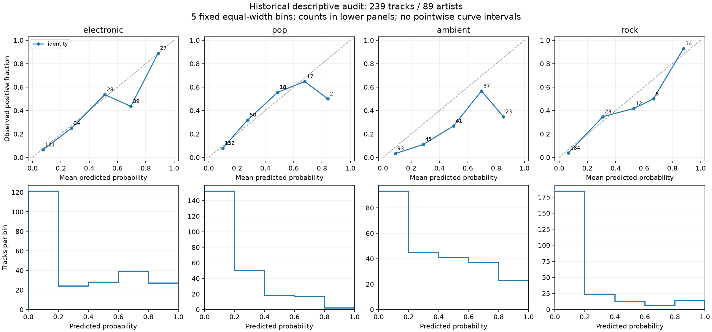
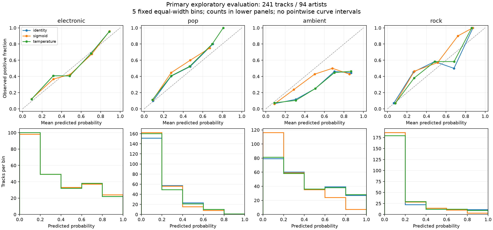

# Probability calibration for multi-label music tagging with limited data

Exploratory research report, first run, 26 September 2026 (Asia/Shanghai). Run: `20260926_v2`.

## Findings

On the primary artist-separated evaluation set, monotone sigmoid calibration reduced macro binary Brier from 0.148661 to 0.141113. The paired difference was −0.007548, with a conditional artist-cluster bootstrap 95% interval of [−0.012572, −0.002081]. Binary temperature scaling changed Brier to 0.148872. Sigmoid improved macro Brier in four of five prespecified splits and worsened it in one. The primary gain came from ambient; the other three labels had higher Brier after sigmoid calibration. These results support further investigation of label-specific probability bias in this historical development sample. They do not establish a universal benefit from calibration.

## Data and local verification

The working checkout matched the audited release commit `fa09b95ef889be769e3d7add4abdb31288fc1191` and initially had no uncommitted changes. Original release code, artifacts, and historical locks were preserved. The retained feature matrix has 1,206 rows and 2,304 columns, float32 storage, finite values, and SHA-256 `cfb693735b4affcd966375926026fb39c45348bb60d19cef8e244ac436aeca52`. Its metadata, original fit IDs, ontology, manifest hash and extraction-source hashes matched their frozen records. Computation promoted features to float64 without altering the cache.

The development pool contains 469 artists and 435/261/244/220 positive tracks for electronic/pop/ambient/rock. Labels were reconstructed from original tags using the frozen broad ontology, not the manifest's historical exact-tag targets. The old 239-track holdout and 90 historical test tracks were excluded from the new fitting pool. Existing audio and encoder files were present; all five encoder receipt file hashes matched. Audio decoding was not repeated because verified features were sufficient. Legacy model joblib files were inventoried without deserializing them. No feature extraction or download was needed.

## Historical descriptive audit (stage A)

The original 239-track set contains 89 artists; 78 tracks have none of the four broad labels. Recomputed macro Brier was **0.12735008535090908**, matching the handoff. No calibrator was trained on these rows.

| Label | Positive fraction | Mean raw probability | Brier | Binary log loss |
| --- | --- | --- | --- | --- |
| electronic | 0.292887 | 0.338445 | 0.138288 | 0.418000 |
| pop | 0.209205 | 0.212496 | 0.128540 | 0.398602 |
| ambient | 0.200837 | 0.363331 | 0.168802 | 0.503779 |
| rock | 0.150628 | 0.174937 | 0.073770 | 0.260427 |

The ambient scores exceed the observed positive fraction on average, and all five displayed ambient bins lie below the diagonal. Some other bins are sparse, including only two tracks in the highest pop bin. These are descriptive observations without curve confidence intervals. The historical set is enriched for target tags and has already been inspected during the project. Forty artists overlap the older historical test set, and a holdout track was used in a decoding example. It cannot support a claim of a wholly untouched final test.

## Experimental design (stage B)

All five splits, methods, bounds and metrics were fixed before new evaluation metrics were generated. This is a local protocol freeze, not external preregistration. Each split assigned whole artists to classifier-fit, calibration and evaluation. A fixed label-balance criterion selected among 256 candidate artist partitions; it did not use model predictions. All candidates and selected indices are retained in [splits.json](results/splits.json). The primary seed was 20260926.

| Subset | Tracks | Artists | Positive tracks E/P/A/R | Positive artists E/P/A/R |
| --- | --- | --- | --- | --- |
| fit | 733 | 281 | 257 / 159 / 136 / 133 | 109 / 70 / 65 / 68 |
| calibration | 232 | 94 | 86 / 44 / 57 / 41 | 40 / 25 / 23 / 22 |
| evaluation | 241 | 94 | 92 / 58 / 51 / 46 | 40 / 24 / 27 / 23 |

Each of four logistic heads used a StandardScaler fitted only on classifier-fit rows, C=0.001, and the historical weight setting (balanced for ambient, unweighted otherwise). The frozen MAEST encoder represented the first 30 seconds of each song using block-7 CLS, DIST and signal-mean features. The published final heads were not reused.

For each binary label, identity returns sigmoid(z); monotone sigmoid calibration returns sigmoid(a*z+b); binary temperature scaling returns sigmoid(z/T). The calibrators minimized unweighted binary log loss on calibration rows only. The slope a (or 1/T) was constrained to [0.001,100]; the sigmoid intercept to [−20,20]. Optimization used analytic gradients and L-BFGS-B. This constrained, unsmoothed Platt-type model differs from the original smoothed-target estimator. All 40 non-identity fits across five splits converged without hitting a bound. Four output columns were never normalized to sum to one.

The primary outcome was equally label-weighted mean binary Brier, with track weighting within each label. Auxiliary outcomes were binary log loss, fixed 5/10 equal-width reliability bins, positive-label ECE and AP. Two thousand bootstrap replicates sampled evaluation artists with replacement, carrying all their tracks, labels and methods together. Intervals are pointwise percentile intervals conditional on the fitted classifier and calibrator; they omit training/calibration sampling uncertainty and have no multiple-comparison adjustment. Overlapping repeated splits were not treated as independent replicates for a t-test.

## Primary results

Differences are calibrated minus raw probability; negative values favor calibration.

| Method | Macro Brier | Delta Brier [95% interval] | Macro log loss |
| --- | --- | --- | --- |
| identity | 0.148661 | Reference | 0.457990 |
| sigmoid | 0.141113 | -0.007548 [-0.012572, -0.002081] | 0.437839 |
| temperature | 0.148872 | +0.000211 [-0.000363, +0.000764] | 0.459900 |

The sigmoid macro log-loss difference was −0.020151 [−0.033838, −0.005698]; the temperature difference was +0.001910 [−0.001091, +0.004972]. These intervals have the same conditional scope as the Brier intervals.

| Label | Raw Brier | Sigmoid Brier | Sigmoid delta [95% interval] | Temperature Brier |
| --- | --- | --- | --- | --- |
| electronic | 0.162428 | 0.162436 | +0.000007 [-0.001474, +0.001653] | 0.162496 |
| pop | 0.146738 | 0.150429 | +0.003691 [-0.001159, +0.009208] | 0.147747 |
| ambient | 0.188850 | 0.152491 | -0.036359 [-0.056510, -0.015587] | 0.189123 |
| rock | 0.096627 | 0.099097 | +0.002470 [-0.002316, +0.007146] | 0.096121 |

Ambient's mean predicted probability changed from 0.392153 to 0.278287 under sigmoid calibration, compared with an observed positive fraction of 0.211618. Its fitted intercept was −0.744920. A remaining average overestimate is visible. The other labels did not share this Brier improvement; their primary sigmoid difference intervals included zero.

| Label | Raw ECE 5 / 10 | Sigmoid ECE 5 / 10 | Temperature ECE 5 / 10 | AP (all methods) |
| --- | --- | --- | --- | --- |
| electronic | 0.0486 / 0.0609 | 0.0432 / 0.0465 | 0.0495 / 0.0640 | 0.7751 |
| pop | 0.0441 / 0.0490 | 0.0657 / 0.0657 | 0.0553 / 0.0570 | 0.5753 |
| ambient | 0.1805 / 0.1833 | 0.0667 / 0.0741 | 0.1796 / 0.1819 | 0.4345 |
| rock | 0.0391 / 0.0435 | 0.0426 / 0.0549 | 0.0370 / 0.0461 | 0.7166 |

Five-bin and ten-bin ECE show the same direction for the primary sigmoid comparison: lower for electronic and ambient, higher for pop and rock. Brier and ECE need not move together, as electronic illustrates. Exact bin counts and empty-bin records accompany every method in the metric JSON. The [ten-bin sensitivity figure](figures/primary_reliability_10.png) is descriptive; sparse tail bins limit interpretation. AP was unchanged across the three methods for each label, consistent with their monotone transformations. No F1 or threshold policy was optimized.

## Stability across the five fixed splits

| Seed | Fit / calibration / evaluation tracks | Raw Brier | Sigmoid delta | Temperature delta |
| --- | --- | --- | --- | --- |
| 20260926 | 733/232/241 | +0.148661 | -0.007548 | +0.000211 |
| 20260927 | 719/244/243 | +0.136040 | +0.003134 | +0.000484 |
| 20260928 | 731/238/237 | +0.148988 | -0.006473 | +0.001456 |
| 20260929 | 727/248/231 | +0.147274 | -0.008056 | +0.000164 |
| 20260930 | 729/231/246 | +0.153442 | -0.007692 | +0.001739 |

Sigmoid worsened electronic Brier in all five splits, improved ambient in all five, and had mixed effects on pop and rock. Its ambient improvement was close to zero in seed 20260927, when losses for the other labels outweighed it. Temperature scaling increased macro Brier and macro log loss in all five splits. These comparisons describe the prespecified splits; selecting ambient-only calibration now would be a post-hoc method choice requiring a new evaluation plan.

## Interpretation and limitations

The primary result is consistent with a useful intercept adjustment for ambient in this sample. The experiment does not isolate the cause of the bias: ambient class weighting, sampling composition, regularization and label noise were not separately varied. Temperature scaling lacks an intercept and did not reproduce the sigmoid gain here. This does not imply that temperature scaling is ineffective in other settings.

Brier and log loss measure overall probability quality and do not isolate pure calibration. Reliability plots add context but remain coarse and noisy at this sample size. The approximately 20% calibration split is the only calibration-data budget studied; this run does not yet establish how performance changes with calibration sample size.

The entire development pool previously informed model selection. Artist separation prevents direct fit/calibration/evaluation artist overlap in the current run, but cannot remove historical selection effects. Label enrichment restricts the target population. Observed tags may be incomplete, broad-ontology choices can affect targets, and whole-track labels may not describe the first 30 seconds. MAEST pretraining overlap with Jamendo remains unaudited. The bootstrap interval must not be read as accounting for those limitations.

## Methodological context and next work

Independent data for fitting the probability mapping and inspection of reliability curves follow the [scikit-learn calibration guidance](https://scikit-learn.org/stable/modules/calibration.html). That documentation also distinguishes overall proper scoring rules from calibration alone. The installed implementation version was 1.9.0; this project implements the two binary mappings explicitly and does not use automatic cross-validation calibration.

[Guo et al. (2017), On Calibration of Modern Neural Networks](https://proceedings.mlr.press/v70/guo17a.html), studied post-hoc temperature scaling for neural classifiers. This experiment uses an independent binary temperature for each music label; it does not apply softmax across non-exclusive tags or assume that the paper's empirical findings transfer to this dataset.

[Ye et al. (2022), Uncertainty Calibration for Deep Audio Classifiers](https://arxiv.org/html/2206.13071), evaluated calibration-related methods on ESC-50 and GTZAN with CNN classifiers, including ensembles and SNGP. Its softmax classification and OOD experiments differ from this frozen-representation multi-label setting. Calibration in audio therefore has relevant prior work; novelty has not been established. This is an initial reading, not a systematic review.

The next exploratory study could fix nested artist subsets of the calibration pool to estimate learning curves before running them. Stronger confirmation needs new songs and artists excluded from all historical data and manual development use, with the sampling population fixed in advance. A sample-size choice should use artist-level precision targets and per-label positives rather than an arbitrary track count. No new data are required to reproduce the current run.

## Reproducibility and execution record

See [research README](../../research/calibration/README.md), [protocol](../../research/calibration/protocol.md), [configuration](results/config.json), [freeze record](results/freeze.json), [split summary](results/split_summary.csv), and [verification](results/verification.json). Small derived evaluation predictions for every split are in `results/`; full fitted parameters, calibration logits, bootstrap draws and source snapshots are in `outputs/calibration/20260926_v2/`. The feature matrix remains an ignored local artifact subject to original dataset/model terms.

Python 3.13.15 used numpy 2.5.2, scipy 1.18.1, scikit-learn 1.9.0 and matplotlib 3.11.1 from the existing environment. Five tests passed for metric definitions, extreme logits, identity/no normalization, artist/row separation and fitting isolation. Independent checks reconstructed every saved evaluation probability from scaler/head/calibrator parameters and cross-checked all Brier/log-loss values against scikit-learn (maximum discrepancy 1.11e−16). The first bootstrap draw was independently reconstructed. Five- and ten-bin figures were generated; the principal five-bin figures were visually inspected.

The first attempt, `20260926_v1`, stopped before evaluation metrics at an identity check because raw logits retained float32 precision. The corrected run explicitly used float64, with identical configuration, protocol and splits. The original failure, source snapshot and [execution notes](../../research/calibration/EXECUTION_NOTES.md) are retained. No unfavorable evaluation result was used to choose this correction.

Development support is documented in the [project development statement](../../AI_ASSISTANCE.md). This report records executed experiments; it does not claim publication, acceptance or independent human validation. Editorial revisions preserve the reported numbers, citations and distinction between exploratory and confirmatory evidence.
