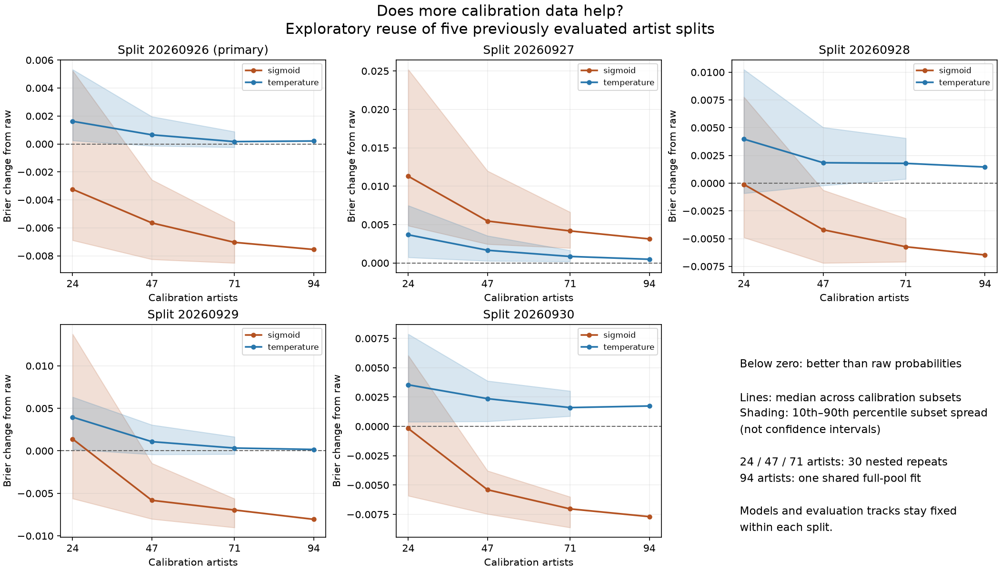
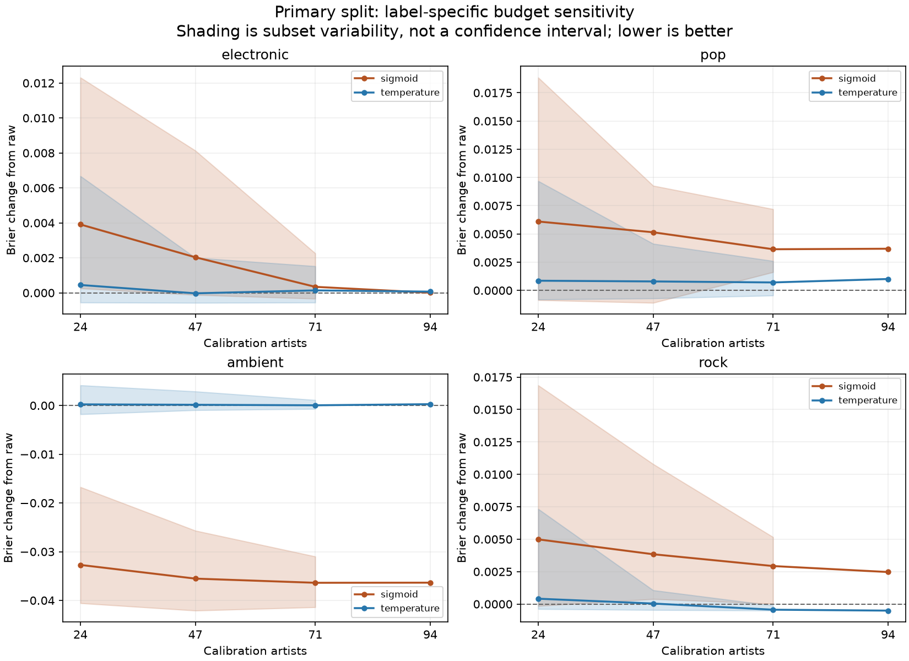

# Calibration data budget: exploratory sensitivity study

Run: `20260926_v1`. This extension asks whether probability calibration becomes more useful
or less sensitive to sample choice when more calibration artists are available.
The previous five-split results were known before this question was tested.

## Findings

In the primary split, sigmoid calibration improved macro Brier in 22/30 subsets of
24 artists, 29/30 subsets of 47 artists and 30/30 subsets of 71 artists. Median Brier
changes were -0.003244, -0.005648 and -0.007038, respectively. The full 94-artist result
was -0.007548. The primary 10th–90th percentile range crossed zero at 24 artists and
was below zero at 47 and 71 artists. This describes sensitivity to the sampled calibration
artists; it is not a probability of success on future evaluation data.

In all five splits, the full-pool sigmoid Brier was lower than the median Brier from
24-artist subsets. However, split 20260927 still had higher Brier than the uncalibrated
model even at the full budget (+0.003134). Increasing calibration data reduced losses
there without producing a net benefit. No universal minimum data requirement follows.

The primary ambient Brier improved in all 30 subsets at each partial budget. In contrast,
electronic, pop and rock had higher median Brier at every budget under sigmoid calibration.
Temperature scaling retained a positive median macro Brier difference in every split at
every budget. These results retain the previous study's label-specific tradeoff.

One 24-artist subset in split 20260930 contained no ambient positives, making both methods'
ambient fits unavailable. It was not redrawn. A separate 24-artist sigmoid/rock fit in
split 20260929 reached the intercept upper bound of 20; its result was retained. These
events illustrate practical failure modes at small calibration budgets. The next useful
exploratory question is why split 20260927 remains unfavorable, including differences
in label composition and raw-score distributions between calibration and evaluation.

## Design

Keep each previous classifier, scaler and evaluation set fixed. Sample 24, 47 and 71
of the 94 calibration artists using 30 seeded permutations per outer split. Prefixes
are nested, and every song by each selected artist is retained. Use all 94 artists as
one full-budget endpoint. The smallest budgets were not label-balanced or redrawn.
No evaluation scores guided sampling, and evaluation labels were excluded from fitting.
All subset plans were frozen before fitting, and every fit was saved before new scoring.

There are 455 subsets and 910 method/subset comparisons. The same sigmoid and binary
temperature implementations and bounds from the [first study](../calibration/REPORT.md)
were reused. The four binary probabilities were not normalized across labels. The raw
model is a fixed reference within each split. Historical holdout songs were not added.

## Primary split

Differences are calibrated minus raw Brier. Negative values favor calibration. Song
counts vary because complete artist groups, not individual songs, were sampled.

| Method | Artists | Tracks: median [range] | Median Brier change | 10–90% subset range | Better than raw | Completed |
| --- | --- | --- | --- | --- | --- | --- |
| sigmoid | 24 | 52.5 [38, 84] | -0.003244 | [-0.006891, +0.005242] | 22/30 | 30/30 |
| sigmoid | 47 | 110.5 [93, 140] | -0.005648 | [-0.008254, -0.002562] | 29/30 | 30/30 |
| sigmoid | 71 | 175.5 [153, 193] | -0.007038 | [-0.008514, -0.005590] | 30/30 | 30/30 |
| sigmoid | 94 | 232 [232, 232] | -0.007548 | One fit | 1/1 | 1/1 |
| temperature | 24 | 52.5 [38, 84] | +0.001622 | [+0.000244, +0.005323] | 0/30 | 30/30 |
| temperature | 47 | 110.5 [93, 140] | +0.000654 | [-0.000136, +0.001959] | 4/30 | 30/30 |
| temperature | 71 | 175.5 [153, 193] | +0.000168 | [-0.000240, +0.000883] | 10/30 | 30/30 |
| temperature | 94 | 232 [232, 232] | +0.000211 | One fit | 0/1 | 1/1 |

The bands describe variability across the 30 randomly selected calibration subsets,
conditional on the existing pool and evaluation sample. They are not confidence intervals
or estimates of population-wide success rates. There is only one full-pool fit per split;
its absence of a shaded range does not imply an absence of uncertainty.

## All five splits and matched comparisons

| Split | Method | 24-artist median change | 94-artist change | Full pool better than small subset |
| --- | --- | --- | --- | --- |
| 20260926 | sigmoid | -0.003244 | -0.007548 | 28/30 |
| 20260926 | temperature | +0.001622 | +0.000211 | 29/30 |
| 20260927 | sigmoid | +0.011295 | +0.003134 | 28/30 |
| 20260927 | temperature | +0.003671 | +0.000484 | 29/30 |
| 20260928 | sigmoid | -0.000111 | -0.006473 | 30/30 |
| 20260928 | temperature | +0.003972 | +0.001456 | 23/30 |
| 20260929 | sigmoid | +0.001396 | -0.008056 | 28/30 |
| 20260929 | temperature | +0.003966 | +0.000164 | 27/30 |
| 20260930 | sigmoid | -0.000177 | -0.007692 | 28/29 |
| 20260930 | temperature | +0.003546 | +0.001739 | 22/29 |

The last column compares each 24-artist fit with the same split's one 94-artist endpoint.
Those 30 comparisons share an endpoint and evaluation rows; they are not independent
experiments. Full-pool agreement with the earlier study is a numerical control, not
additional independent evidence. Adjacent-budget paired comparisons, all label-level
metrics and binary log loss are retained in the result tables.

## Completeness and checks

Completed macro comparisons: 908/910.
Fit unavailability or bound-hit records: 3; all are retained in
[optimizer exceptions](results/optimizer_exceptions.json). Single-class labels, if any,
are unavailable rather than replaced by raw predictions. Macro scores are unavailable
when one label fails. Bound-constrained estimates remain visible in summaries.

Tests check nested whole-artist sampling, one shared full-budget endpoint, deterministic
sampling unaffected by labels, no influence from unselected calibration observations or
evaluation logits on fitted parameters, and explicit single-class failures. The numerical
verification reconstructs all new probabilities, checks metrics against scikit-learn,
and checks full-budget equality with the prior predictions. See
[verification](results/verification.json).

## Limits

These curves reuse evaluation sets already inspected in the first study and remain
exploratory. They cover only subsets of 94 calibration artists per split, not arbitrarily
large calibration datasets. Classifier training size was held fixed. Target enrichment,
historical model selection, noisy tags, clip/whole-track mismatch and unaudited pretraining
overlap still apply. A stable adjustment can remain unhelpful on a particular evaluation
set. This experiment does not justify selecting a method, label policy or minimum sample
size for deployment from these curves alone.

## Reproduction and files

See [protocol](../../research/calibration_budget/protocol.md),
[commands](../../research/calibration_budget/README.md), [freeze record](results/freeze.json),
[summary](results/summary.csv) and [all metrics](results/metrics.csv).
Complete subset IDs, calibration counts, parameters, probabilities and source snapshots
are in `outputs/calibration_budget/20260926_v1` under the repository root. The original study's
source, caches and results were kept unchanged. No new audio or model downloads were used.

Development support is documented in the [project development statement](../../AI_ASSISTANCE.md).
This report records exploratory results and does not claim independent confirmation.
