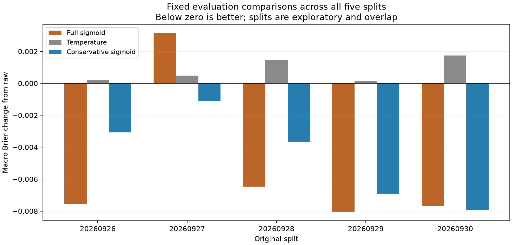
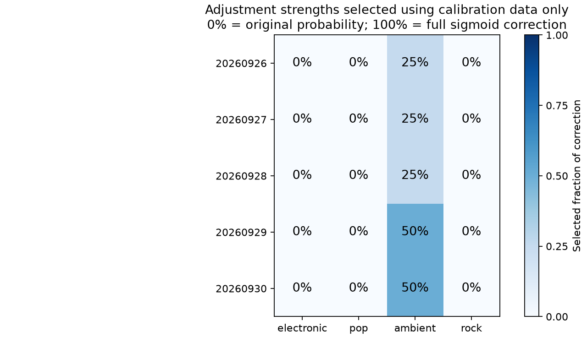
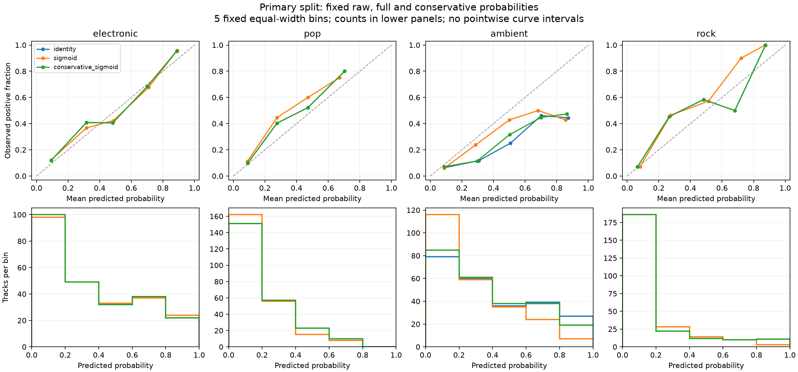

# Conservative calibration using calibration-only internal validation

Exploratory run `20260926_v1`. This policy was designed after the original evaluation
results and failure diagnostics had been inspected. It is not independent confirmation.

## Findings

The conservative policy had lower macro Brier than raw probabilities in 5/5
original splits and lower macro Brier than full sigmoid in 2/5 splits.
It retained raw probabilities for 15/20 label/split combinations. There were
0 explicit identity fallbacks caused by unusable fits. Numerical details
are retained below, including every unfavorable outcome. Frequencies across these
overlapping splits are not estimates of future success probability.

Only ambient received a nonzero correction: 25% in the first three splits and 50%
in the last two. Of the 15 identity selections, identity already minimized OOF Brier
in 13; the paired-SE tolerance reduced the remaining two to identity. The result
therefore concerns the complete selection policy, not a demonstrated isolated effect
of the SE rule. All 120 inner/full sigmoid fits converged without hitting a bound.
Nine unit tests passed separately from the 1,128 numerical/artifact checks.

The tradeoff is visible in the primary split: conservative calibration improved on
raw probabilities but retained less of the full sigmoid benefit. It also improved
on raw and full sigmoid in the previously unfavorable second split. These observations
do not establish a generally safer method or identify the causal mechanism of failure.

| Split | Raw Brier | Full sigmoid Brier | Conservative Brier | Conservative − raw | Conservative − full |
| --- | --- | --- | --- | --- | --- |
| 20260926 | 0.148661 | 0.141113 | 0.145591 | -0.003070 | +0.004478 |
| 20260927 | 0.136040 | 0.139173 | 0.134929 | -0.001111 | -0.004244 |
| 20260928 | 0.148988 | 0.142515 | 0.145335 | -0.003653 | +0.002820 |
| 20260929 | 0.147274 | 0.139218 | 0.140356 | -0.006917 | +0.001138 |
| 20260930 | 0.153442 | 0.145750 | 0.145511 | -0.007931 | -0.000239 |

## How the policy was chosen

Within each original calibration pool, 94 artists were assigned to five fixed folds.
Sigmoid mappings fitted on four folds predicted the fifth; no artist crossed the
inner fitting/validation boundary. The original music classifier remained fixed and
had never fitted these calibration rows. Each row received one OOF sigmoid probability.

For each label, candidate probabilities blended raw and OOF sigmoid outputs using
0%, 25%, 50%, 75% or 100% of the correction. The lowest OOF Brier candidate was found,
then the smallest adjustment within a paired artist-cluster SE proxy of that loss was
selected. The proxy uses candidate-minus-raw losses. Its exact formula and all numerical
ties are specified in the [protocol](../../research/calibration_conservative/protocol.md).
This is a paired-SE shrinkage heuristic, not a formal significance test or a guarantee
against degradation. The SE ignores overlapping fold training and winner selection.

After selection, the sigmoid was refitted on all calibration rows and the chosen blend
was applied to the original evaluation logits. The final sigmoid predictions reproduced
the previous full sigmoid baseline. All 20 strengths were saved before any new evaluation
metric was calculated. Evaluation labels and logits are not arguments of the selection
function. The evaluation results were not used to revise the rule.

| Split | electronic | pop | ambient | rock |
| --- | --- | --- | --- | --- |
| 20260926 | 0% | 0% | 25% | 0% |
| 20260927 | 0% | 0% | 25% | 0% |
| 20260928 | 0% | 0% | 25% | 0% |
| 20260929 | 0% | 0% | 50% | 0% |
| 20260930 | 0% | 0% | 50% | 0% |

The percentages describe a fraction of the probability correction, not confidence,
accuracy or the fraction of songs classified correctly. At 0%, output equals raw
probability exactly. All four music labels retain separate binary probabilities.
Identity fallbacks, if any, are policy decisions with logged causes; no fold seeds
were retried to obtain a better selection.

## Primary split and uncertainty

| Label | Raw Brier | Full sigmoid Brier | Conservative Brier |
| --- | --- | --- | --- |
| electronic | 0.162428 | 0.162436 | 0.162428 |
| pop | 0.146738 | 0.150429 | 0.146738 |
| ambient | 0.188850 | 0.152491 | 0.176569 |
| rock | 0.096627 | 0.099097 | 0.096627 |

| Reference | Metric | Conservative difference | Conditional 95% interval |
| --- | --- | --- | --- |
| raw | brier | -0.003070 | [-0.004358, -0.001679] |
| raw | log_loss | -0.008752 | [-0.012592, -0.004581] |
| full_sigmoid | brier | +0.004478 | [+0.000198, +0.008471] |
| full_sigmoid | log_loss | +0.011399 | [+0.000193, +0.021480] |

These pointwise percentile intervals use 2,000 paired resamples of evaluation artists.
Both comparisons reuse the same resampling indices. Intervals condition on the fitted
classifier, calibration data and selected policy. They do not include method-development
history, selection/refitting uncertainty or multiple-comparison adjustment. The selected
OOF losses are tuning diagnostics, not unbiased test results. Log loss, AP, exact bin
counts and ten-bin sensitivity figures are also retained.

## Interpretation limits

Conservatism can discard a useful correction or retain a harmful one. OOF sigmoids use
less calibration data than the full-pool refit; a selected blend need not transfer
perfectly to that refit. Reusing the previous evaluation pools keeps this study
exploratory even though the new selection code excludes their labels. The five splits
overlap and no ordinary independent-sample t-test is justified.

Target enrichment, observed-tag incompleteness, first-30-second/whole-track mismatch,
prior model selection and unaudited encoder-pretraining overlap remain limitations.
No original application model was replaced and no claim of novel methodology or
publication is made. Stronger validation would require a separately fixed protocol
and previously unused songs and artists.

## Method sources and verification

The preference for a simpler option near the validation minimum follows the
[one-standard-error principle described in Stanford STATS 202](https://web.stanford.edu/class/stats202/notes/Resampling/Kfold-CV.html).
Our paired artist-cluster tolerance is a specified adaptation, not the textbook
foldwise calculation. [scikit-learn's grouped-CV guidance](https://scikit-learn.org/stable/modules/cross_validation.html)
motivates preserving groups across validation boundaries. [Bates, Hastie and Tibshirani](https://arxiv.org/abs/2104.00673)
discuss why dependencies make ordinary CV uncertainty estimates problematic; their
work does not validate this particular heuristic.

See [verification](results/verification.json), [reproduction commands](../../research/calibration_conservative/README.md),
[selected strengths](results/strengths.csv), [candidate scores](results/candidates.csv),
and [all macro results](results/summary.csv). Complete OOF predictions, inner-fold
parameters, source snapshots and bootstrap draws are in `outputs/calibration_conservative/20260926_v1/`.
Tests are executed separately from numerical verification. Codex assisted with design,
implementation, execution and writing, with independent code/design checks.
