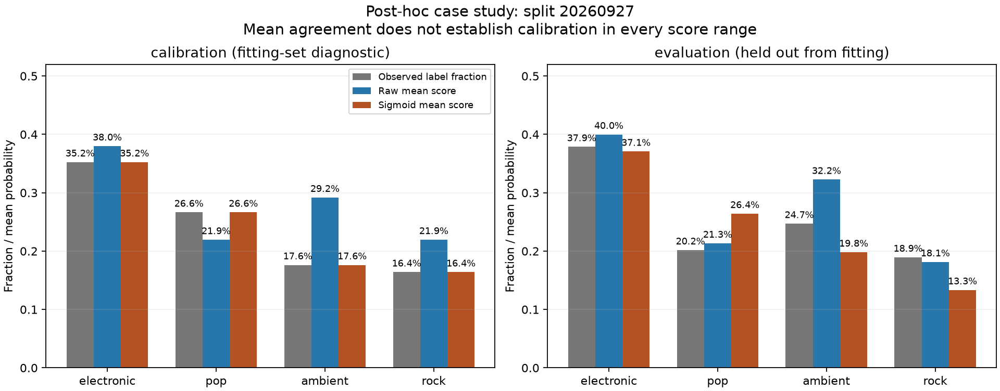
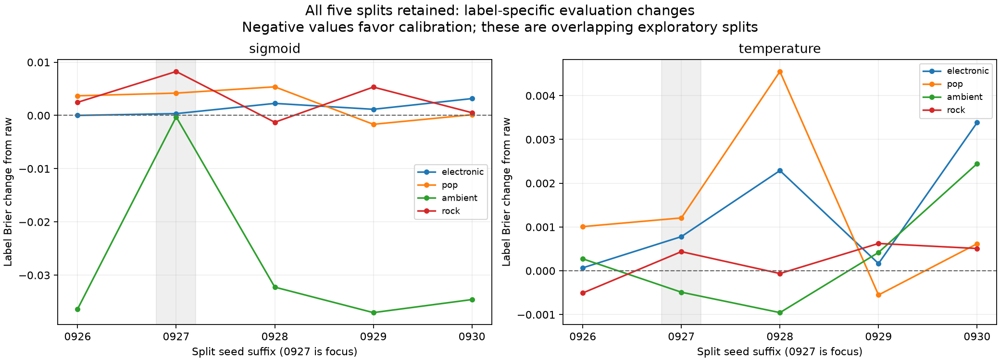
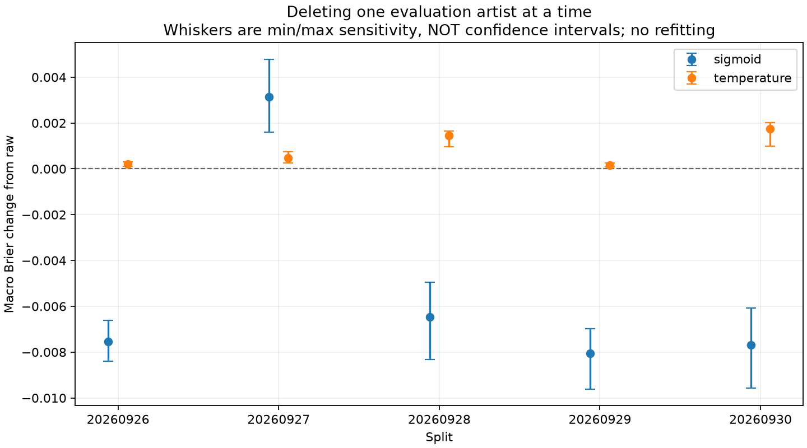

# Why one split worsened: post-hoc calibration diagnostics

Run `20260926_v1`. Focus split: 20260927, selected after the first two studies showed
unfavorable sigmoid calibration. The analysis is descriptive and outcome-selected.
It uses saved probabilities and parameters only; **no model or calibrator was fitted**.
All five original splits remain in the tables and figures.

## Findings

The focus split's sigmoid-minus-raw macro Brier change was +0.003134. Rock contributed
+0.002066 to the macro change and pop +0.001050. Electronic contributed +0.000086,
while ambient contributed only -0.000068. Thus the failure combined increased rock/pop
loss with almost none of the ambient benefit observed in the other four splits.

For rock, calibration data had a 16.39% positive fraction versus a raw mean of 21.94%.
The fitted map decreased its mean. Evaluation data had a positive fraction of 18.93%
and a raw mean of 18.13%, but the map reduced the evaluation mean to 13.33%. For pop,
the evaluation fraction was 20.16%; the raw mean of 21.32% increased to 26.40%.
These mean changes moved away from the evaluation fractions. The label-level Brier
changes independently confirm increased probability loss; the argument does not rely
on mean agreement alone.

Ambient's evaluation mean changed from 32.25% to 19.80%, compared with an observed
fraction of 24.69%. Its Brier change was -0.000271. The benefits on negative rows
(-0.049293, normalized by all evaluation rows) almost exactly offset the harms on
positive rows (+0.049022). This differs from the much larger ambient gains in the
other splits and limits the overall benefit here.

Deleting each of the 94 evaluation artists in turn left the sigmoid macro difference
positive, from +0.001591 to +0.004780. Artist-equal weighting also remained unfavorable
(+0.003766). The top five positive contributors accounted for 39.05% of the summed
positive contributions, not 39.05% of the net change. No single evaluation-artist
deletion reverses the observed result; this does not establish statistical significance
or rule out sensitivity to combinations of artists.

These observations are consistent with a correction learned on calibration examples
transferring poorly to this evaluation sample. They do not establish that prevalence
shift alone caused the failure. Conditional scores also differ: among rock-negative
tracks, the raw mean was 0.1585 in calibration and 0.1093 in evaluation. Within the fixed
raw-score bin [0.2,0.4), rock-positive fractions were 7/47 (14.89%) in calibration and
13/27 (48.15%) in evaluation. This coarse-bin illustration is post hoc and has limited
sample size; it is not a conditional-distribution test. An independent read-only
calculation reproduced the principal numerical findings.

## Calibration and evaluation composition

| Label | Calibration positive fraction | Evaluation positive fraction | Evaluation raw mean | Evaluation sigmoid mean |
| --- | --- | --- | --- | --- |
| electronic | 35.25% | 37.86% | 39.98% | 37.07% |
| pop | 26.64% | 20.16% | 21.32% | 26.40% |
| ambient | 17.62% | 24.69% | 32.25% | 19.80% |
| rock | 16.39% | 18.93% | 18.13% | 13.33% |

The calibration column describes the data used to fit the correction. Its fitted mean
agreement is an in-sample diagnostic. A match between a mean score and a label fraction
does not establish agreement throughout the score range. Fixed five-bin tables retain
counts of both tracks and artists in [raw-bin diagnostics](results/fixed_raw_bins.csv).

## Where the probability loss changes

| Label | Calibration Brier change (in sample) | Evaluation Brier change | Contribution to macro change |
| --- | --- | --- | --- |
| electronic | +0.000113 | +0.000345 | +0.000086 |
| pop | -0.001719 | +0.004200 | +0.001050 |
| ambient | -0.020170 | -0.000271 | -0.000068 |
| rock | -0.004581 | +0.008262 | +0.002066 |

Calibration Brier is reported descriptively even though the optimizer minimized log loss.
Evaluation values use the identical rows and classifier before and after recalibration.
Label contributions add to the macro change. Complete binary log-loss values are in
[probability summaries](results/probability_summary.csv).

For q as calibrated probability, p as raw probability and d=q-p, the exact identity is
mean[(q-y)^2-(p-y)^2] = mean[d^2] + 2*mean[d*(p-y)]. The first term is adjustment magnitude;
the second describes alignment with the raw error on these rows. This algebra does not
identify a causal mechanism. Both terms and positive/negative-target contributions are
saved for every label and subset in [decomposition](results/brier_decomposition.csv).

## Conditional score behavior

| Label | Observed target | Calibration raw mean | Evaluation raw mean | Calibration/evaluation tracks |
| --- | --- | --- | --- | --- |
| electronic | 0 | 0.2443 | 0.2787 | 158/151 |
| electronic | 1 | 0.6288 | 0.5984 | 86/92 |
| pop | 0 | 0.1721 | 0.1946 | 179/194 |
| pop | 1 | 0.3494 | 0.2871 | 65/49 |
| ambient | 0 | 0.2476 | 0.2482 | 201/183 |
| ambient | 1 | 0.4981 | 0.5490 | 43/60 |
| rock | 0 | 0.1585 | 0.1093 | 204/197 |
| rock | 1 | 0.5302 | 0.4893 | 40/46 |

Conditioning on the observed label exposes score differences that cannot be summarized
by class proportions alone. These are descriptive sample differences; neither equality
nor a distribution-shift model is tested. Quantiles and artist counts accompany the full
[conditional table](results/conditional_raw_scores.csv).

## Artist sensitivity

| Split | Method | Track-weighted change | Artist-equal change | Delete-one range | Delete-one results below zero |
| --- | --- | --- | --- | --- | --- |
| 20260926 | sigmoid | -0.007548 | -0.005490 | [-0.008407, -0.006610] | 94/94 |
| 20260926 | temperature | +0.000211 | +0.000192 | [+0.000105, +0.000315] | 0/94 |
| 20260927 | sigmoid | +0.003134 | +0.003766 | [+0.001591, +0.004780] | 0/94 |
| 20260927 | temperature | +0.000484 | +0.000742 | [+0.000244, +0.000747] | 0/94 |
| 20260928 | sigmoid | -0.006473 | -0.006004 | [-0.008327, -0.004943] | 94/94 |
| 20260928 | temperature | +0.001456 | +0.001590 | [+0.000959, +0.001639] | 0/94 |
| 20260929 | sigmoid | -0.008056 | -0.009944 | [-0.009617, -0.006991] | 94/94 |
| 20260929 | temperature | +0.000164 | +0.000188 | [+0.000086, +0.000258] | 0/94 |
| 20260930 | sigmoid | -0.007692 | -0.010844 | [-0.009577, -0.006080] | 94/94 |
| 20260930 | temperature | +0.001739 | +0.000516 | [+0.000998, +0.002016] | 0/94 |

The track-weighted change is the original estimand. Artist-equal weighting answers a
different question and is shown only as sensitivity. Deleting one evaluation artist
does not refit the model and is not a rule for cleaning the data. All deletion results
and signed contributions are retained in [artist contributions](results/artist_contributions.csv).
The top-five concentration statistic uses the sum of positive contributions as its
denominator, avoiding cancellation by beneficial contributions. It does not measure
the fraction of a causal error explained by those artists.

## Limits and reproducibility

A next exploratory study could test conservative calibration, using artist-grouped
validation entirely inside the calibration pool to choose whether or how strongly to
adjust each label. Identity must remain an available option. Such a method would be
motivated by observed outcomes and would still need independent validation before a
confirmatory or deployment claim. No such method was fitted or selected in this report.

The focus split was chosen after its result was known. Evaluation labels are used here
to understand an existing outcome, not to select a new method, label policy or threshold.
Mean gaps do not prove label shift, score-bin differences do not establish causality,
and a stable delete-one sign is not a significance test. This analysis addresses
evaluation artist composition, not the effect of deleting calibration artists and refitting.
All prior limitations concerning enriched sampling, historical development use, observed
tags and encoder pretraining overlap continue to apply.

See [protocol](../../research/calibration_diagnostics/protocol.md),
[commands](../../research/calibration_diagnostics/README.md),
[freeze record](results/freeze.json), [numerical verification](results/verification.json),
and [plain-language explanation](SUMMARY_ZH.md). New tests check exact loss identities,
artist aggregation, direct deletion calculations, fixed raw-bin membership and empty
cases. Full inputs and old source hashes were rechecked; the original studies remain
unchanged. Codex assisted with implementation and reporting, with independent read-only
agent checks of the design and numerical conclusions. No independent scientific
validation is claimed.
