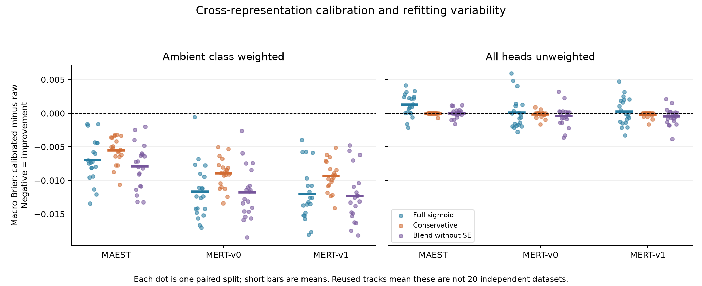
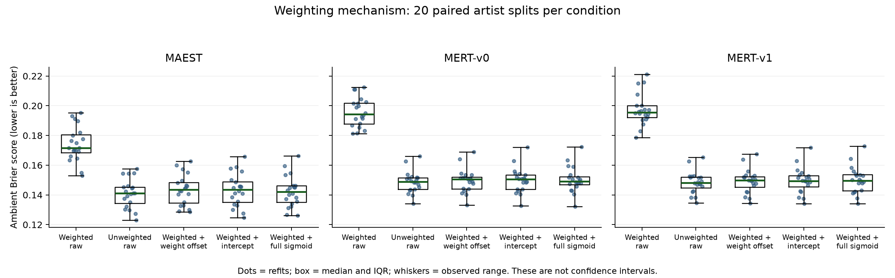

# Calibration extension: mechanism, representation transfer and refitting variability

This report contains all prespecified 20 artist-separated refits of three frozen audio representations and two weighting conditions: 120 fitted pipelines. Each pipeline has seven probability treatments. This is an exploratory extension on previously used data; the application has not been updated.

## Findings

Under ambient-balanced training, full sigmoid reduces macro Brier in all 20 main splits for each representation. When all heads are unweighted, its mean macro Brier change is positive for all three representations: calibration slightly worsens the average. The unweighted improvement counts are 4/20 for MAEST and 11/20 for each MERT version. The MERT median changes can still be slightly negative; an improvement count does not determine the mean effect.

Balanced ambient raw Brier is worse than unweighted ambient raw Brier in all 20 splits for each representation. A fit-prevalence offset or an intercept-only calibrator obtains ambient error close to full sigmoid. These controlled comparisons support class-weight-induced probability displacement as an important source of the apparent calibration benefit in this setup. They do not identify a percentage of benefit causally attributable to weighting or justify avoiding weighting for every task. Other objectives, such as recall or cost-sensitive decisions, were not optimized in this extension.

The SE-tolerant blend has higher macro Brier than the same OOF blend without SE in 17/20 balanced splits for each representation. Its smaller adjustment therefore has a measurable cost here. Neither blend is established as a generally superior calibration method.

## Design and reproducibility

The main pool has 1,206 songs / 469 artist IDs. Each paired split allocates approximately 60/20/20% of artists to classifier fitting, calibration, and evaluation. Scalers, four logistic heads and calibrators are newly fitted per split; audio encoders are fixed. All representations share splits, C=0.001 and optimizer settings. MERT-v0/v1 use the mean of transformer layers 1–12. The different dimensions make this a fixed-configuration transfer test, not a ranking of best-tuned encoders.

Methods and seeds were frozen before new fits. The v1 implementation was superseded by v2 solely to strengthen provenance guards, before numerical outcome inspection; see [execution history](EXECUTION_NOTES.md). The datasets and methods were chosen with earlier results already known; this is not a prospective preregistration.

## Main evaluation: all methods

Numbers below are means across the 20 split-specific metrics; every split has equal weight. Improvement counts compare each treatment with its own raw condition. The splits overlap, so their ranges/quantiles describe partition/refitting variability; they are not confidence intervals or evidence from 20 independent datasets.

| Representation | Weighting | Method | Mean macro Brier | Mean delta vs raw | Improved / 20 | Mean log loss |
| --- | --- | --- | ---: | ---: | ---: | ---: |
| MAEST | ambient_balanced | raw | 0.140444 | +0.000000 | 0 | 0.437292 |
| MAEST | ambient_balanced | prior_offset | 0.132749 | -0.007695 | 20 | 0.418997 |
| MAEST | ambient_balanced | intercept | 0.133012 | -0.007432 | 20 | 0.419084 |
| MAEST | ambient_balanced | sigmoid | 0.133502 | -0.006941 | 20 | 0.420831 |
| MAEST | ambient_balanced | temperature | 0.141209 | +0.000765 | 2 | 0.440162 |
| MAEST | ambient_balanced | conservative | 0.134927 | -0.005517 | 20 | 0.423108 |
| MAEST | ambient_balanced | blend_min | 0.132522 | -0.007922 | 20 | 0.417702 |
| MAEST | unweighted | raw | 0.132160 | +0.000000 | 0 | 0.416233 |
| MAEST | unweighted | prior_offset | 0.132160 | +0.000000 | 0 | 0.416233 |
| MAEST | unweighted | intercept | 0.132593 | +0.000433 | 8 | 0.417600 |
| MAEST | unweighted | sigmoid | 0.133395 | +0.001235 | 4 | 0.420494 |
| MAEST | unweighted | temperature | 0.132807 | +0.000647 | 2 | 0.418966 |
| MAEST | unweighted | conservative | 0.132125 | -0.000034 | 1 | 0.416158 |
| MAEST | unweighted | blend_min | 0.132179 | +0.000019 | 7 | 0.416311 |
| MERT-v0 | ambient_balanced | raw | 0.155747 | +0.000000 | 0 | 0.479371 |
| MERT-v0 | ambient_balanced | prior_offset | 0.144222 | -0.011525 | 20 | 0.450880 |
| MERT-v0 | ambient_balanced | intercept | 0.144320 | -0.011427 | 20 | 0.451219 |
| MERT-v0 | ambient_balanced | sigmoid | 0.144058 | -0.011689 | 20 | 0.451728 |
| MERT-v0 | ambient_balanced | temperature | 0.155861 | +0.000115 | 11 | 0.480184 |
| MERT-v0 | ambient_balanced | conservative | 0.146791 | -0.008956 | 20 | 0.457535 |
| MERT-v0 | ambient_balanced | blend_min | 0.143949 | -0.011798 | 20 | 0.450528 |
| MERT-v0 | unweighted | raw | 0.143994 | +0.000000 | 0 | 0.450388 |
| MERT-v0 | unweighted | prior_offset | 0.143994 | +0.000000 | 0 | 0.450388 |
| MERT-v0 | unweighted | intercept | 0.144200 | +0.000206 | 7 | 0.451204 |
| MERT-v0 | unweighted | sigmoid | 0.144097 | +0.000103 | 11 | 0.452062 |
| MERT-v0 | unweighted | temperature | 0.144027 | +0.000033 | 9 | 0.450945 |
| MERT-v0 | unweighted | conservative | 0.143864 | -0.000130 | 6 | 0.450019 |
| MERT-v0 | unweighted | blend_min | 0.143570 | -0.000424 | 11 | 0.449525 |
| MERT-v1 | ambient_balanced | raw | 0.156258 | +0.000000 | 0 | 0.480408 |
| MERT-v1 | ambient_balanced | prior_offset | 0.144204 | -0.012054 | 20 | 0.450751 |
| MERT-v1 | ambient_balanced | intercept | 0.144330 | -0.011928 | 20 | 0.451185 |
| MERT-v1 | ambient_balanced | sigmoid | 0.144253 | -0.012004 | 20 | 0.452079 |
| MERT-v1 | ambient_balanced | temperature | 0.156521 | +0.000263 | 10 | 0.481439 |
| MERT-v1 | ambient_balanced | conservative | 0.146885 | -0.009373 | 20 | 0.457731 |
| MERT-v1 | ambient_balanced | blend_min | 0.143906 | -0.012352 | 20 | 0.450272 |
| MERT-v1 | unweighted | raw | 0.144019 | +0.000000 | 0 | 0.450425 |
| MERT-v1 | unweighted | prior_offset | 0.144019 | +0.000000 | 0 | 0.450425 |
| MERT-v1 | unweighted | intercept | 0.144233 | +0.000214 | 8 | 0.451236 |
| MERT-v1 | unweighted | sigmoid | 0.144292 | +0.000273 | 11 | 0.452453 |
| MERT-v1 | unweighted | temperature | 0.144251 | +0.000232 | 10 | 0.451502 |
| MERT-v1 | unweighted | conservative | 0.143827 | -0.000192 | 5 | 0.449901 |
| MERT-v1 | unweighted | blend_min | 0.143540 | -0.000479 | 11 | 0.449319 |

## Ambient weighting mechanism

Only ambient weighting changes. The analytic offset adds log(n_positive/n_negative), with counts from classifier fitting. It is a control for idealized class-weight log-odds distortion, not an algebraic reconstruction of a separately refitted unweighted regularized classifier. Intercept-only calibration fits an additive shift; full sigmoid also changes slope.

| Representation | Balanced raw Brier | Unweighted raw Brier | Balanced + offset | Balanced + intercept | Balanced + sigmoid | Unweighted + sigmoid |
| --- | ---: | ---: | ---: | ---: | ---: | ---: |
| MAEST | 0.174216 | 0.141081 | 0.143435 | 0.143299 | 0.142353 | 0.141925 |
| MERT-v0 | 0.195662 | 0.148651 | 0.149563 | 0.149896 | 0.150304 | 0.150464 |
| MERT-v1 | 0.197428 | 0.148473 | 0.149212 | 0.149619 | 0.149972 | 0.150128 |

As a descriptive check, the following averages use the same 20 main evaluation partitions. Matching an overall mean score to prevalence is not sufficient for calibration within probability bins.

| Representation | Observed ambient fraction | Balanced raw mean score | Unweighted raw mean score |
| --- | ---: | ---: | ---: |
| MAEST | 0.2066 | 0.3611 | 0.2011 |
| MERT-v0 | 0.2066 | 0.4135 | 0.2026 |
| MERT-v1 | 0.2066 | 0.4181 | 0.2044 |

The stored mechanism table includes per-seed differences of loss deltas: `(balanced calibrated − balanced raw) − (unweighted calibrated − unweighted raw)`. A negative number means the balanced condition obtains more calibration improvement. This does not imply that all of the original gain is caused by weighting.

## Removing the SE tolerance

The minimum-OOF blend reuses exactly the same inner-fold predictions and full sigmoid fits as the conservative blend. Only the strength selection rule changes. Positive differences below mean the SE rule has higher error.

| Representation | Weighting | Mean Brier: conservative minus no-SE blend | Conservative better / 20 |
| --- | --- | ---: | ---: |
| MAEST | ambient_balanced | +0.002405 | 3 |
| MAEST | unweighted | -0.000053 | 10 |
| MERT-v0 | ambient_balanced | +0.002842 | 3 |
| MERT-v0 | unweighted | +0.000294 | 8 |
| MERT-v1 | ambient_balanced | +0.002979 | 3 |
| MERT-v1 | unweighted | +0.000286 | 7 |

## Retrospective 266-song stress check

The 266 tracks / 200 artist IDs are artist-disjoint from the development pool, but their MAEST outcomes had been inspected before this extension. All new pipeline predictions on them are retrospective. The same 266 are used for each refit; they are not new independent test sets or a second data source. No fitting or per-run strength selection uses this cohort; all seven treatments are reported without outcome-based filtering.

| Representation | Weighting | Raw Brier | Sigmoid Brier | Sigmoid improved / 20 | Conservative Brier | Conservative improved / 20 |
| --- | --- | ---: | ---: | ---: | ---: | ---: |
| MAEST | ambient_balanced | 0.135356 | 0.129063 | 20 | 0.129926 | 20 |
| MAEST | unweighted | 0.126765 | 0.128779 | 1 | 0.126785 | 0 |
| MERT-v0 | ambient_balanced | 0.151614 | 0.141427 | 20 | 0.143046 | 20 |
| MERT-v0 | unweighted | 0.141050 | 0.141383 | 9 | 0.140841 | 8 |
| MERT-v1 | ambient_balanced | 0.149340 | 0.139014 | 20 | 0.140691 | 20 |
| MERT-v1 | unweighted | 0.138703 | 0.139009 | 9 | 0.138534 | 6 |

The retrospective cohort repeats the conditional pattern: full sigmoid improves every balanced-condition refit, but has slightly adverse mean changes under all three unweighted conditions. Its unweighted improvement counts are 1/20 for MAEST and 9/20 for each MERT version. This is supplementary consistency on an already observed cohort, not new independent confirmation.

## Verification and limits

Inner-policy label fallbacks: 0. Full optimizer statuses, boundary solutions, folds and head parameters are retained in the local run. The independent verifier reconstructs predictions, calibrators, OOF selection, split membership, per-label metrics, negative controls and summary distributions.

Limitations: one Jamendo source; four broad observed tags; incomplete or segment-mismatched labels; historical sample selection; label-balanced split selection; frozen encoders and one head regularization setting; two related MERT versions. No cross-dataset or fully unexposed prospective validation is claimed. Artist aliases, pretrained-model overlap and undocumented prior external use remain unresolved. Brier/log-loss improvements are probability-quality results, not classification accuracy improvements. The standard monotone transformations preserve within-label ranking, apart from numerical saturation/ties; the weighting intervention itself can change ranking.

Neither probability calibration nor class-weight distortion is a new discovery. Caplin, Martin and Marx (2022) [already explain class-weight miscalibration and derive a probability correction](https://arxiv.org/abs/2205.04613). The additive log-odds offset here is a standard control, not a new method. This is a reproducible empirical study of their interaction in this particular music setup. A publication claim requires a clearer distinction from existing work and further evidence on another data source or prespecified untouched sample.

See the [protocol](PROTOCOL.md), [all score rows](results/scores.csv), [mechanism contrasts](results/mechanism.csv), [calibration parameters](results/parameters.csv), and [reproduction guide](../../research/calibration_extension/README.md).

Background: [calibration survey](https://arxiv.org/abs/2112.10327), [deep audio calibration](https://arxiv.org/abs/2206.13071), [calibrating for class weights](https://arxiv.org/abs/2205.04613), [class-imbalance correction study](https://arxiv.org/abs/2202.09101), [sklearn class-weight definition](https://scikit-learn.org/stable/modules/generated/sklearn.linear_model.LogisticRegression.html).

## Validation record

The independent verification completed 456,414 checks with 0 errors, covering 120 main runs and 120 retrospective runs. The maximum absolute numerical reconstruction difference was 3.02e-14. The 16 unit tests passed. Both MERT historical audio controls exactly reproduced their original cached features. All 1,440 full intercept/sigmoid/temperature fits converged without hitting their parameter bounds. Verification is an implementation and provenance check; its check count is not scientific sample size or independent replication.
