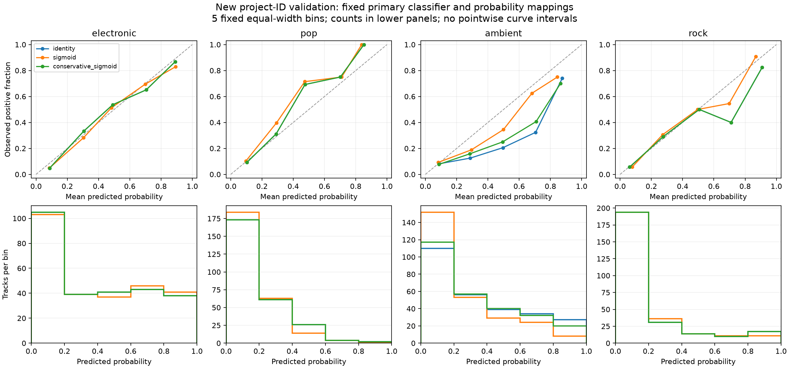
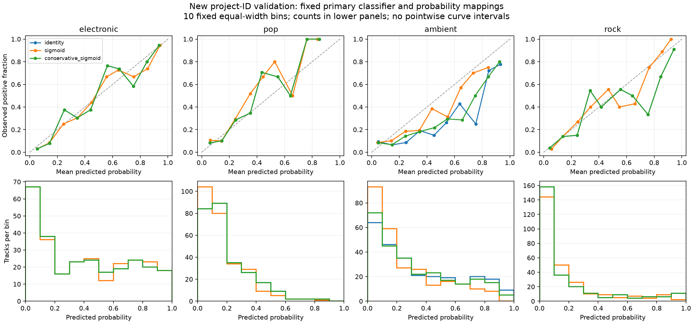

# Fixed probability-calibration validation on new documented project IDs

Run `20260927_v1` evaluates the previously designated primary research classifier and
its already selected probability correction. This is a new sample relative to documented
project track and artist IDs. It does not establish freedom from undocumented listening,
artist aliases/collaborations, or upstream encoder-pretraining exposure.

## Fixed comparison and numerical outcomes

The classifier was fitted on 733 historical development songs; the sigmoid mappings
were fitted on 232 different songs. The saved conservative strengths are electronic 0%, pop 0%, ambient 25%, rock 0%.
The encoder, classifier, calibration parameters and strengths were not refitted.
The same songs are scored by raw, full sigmoid and conservative sigmoid methods.

The primary endpoint is **conservative minus raw track-weighted macro binary Brier**,
with equal weight for the four labels. Lower Brier/log loss is better; a negative
paired difference favors conservative calibration. Full sigmoid is a fixed secondary
comparator. Tables report all outcomes without selecting the favorable comparison.

On the fully observed 266-track sample, conservative correction reduced macro Brier
relative to raw probabilities by 0.002608 (about 1.95% relative reduction), while the
full sigmoid point estimate improved by 0.007460 (about 5.58%). The prespecified
conservative-minus-raw interval is negative, and the conservative-minus-full interval
is positive. This supports transfer of the fixed correction versus raw on this sample,
while favoring full sigmoid over the conservative method under the stated conditional
comparison. It does not establish conservative superiority, general safety, or better
music recognition. Relative Brier reductions are not accuracy percentage-point gains.

All conservative improvement came from ambient; the other three label outputs were
exactly unchanged. Full sigmoid improved ambient and rock Brier while slightly
worsening electronic and pop. Fourteen synthetic program tests and 5,550 independent
numerical/artifact checks passed. The historical classifier and encoder controls both
reproduced their saved outputs with maximum absolute error zero.

| Method | Macro Brier | Difference versus raw | Difference versus full sigmoid | Macro log loss |
| --- | --- | --- | --- | --- |
| identity | 0.133726 | +0.000000 | +0.007460 | 0.420120 |
| sigmoid | 0.126266 | -0.007460 | +0.000000 | 0.403301 |
| conservative_sigmoid | 0.131118 | -0.002608 | +0.004852 | 0.413569 |

| Comparator | Metric | Conservative difference | Conditional 95% interval |
| --- | --- | --- | --- |
| raw probabilities | brier | -0.002608 | [-0.003548, -0.001673] |
| raw probabilities | log_loss | -0.006551 | [-0.009071, -0.004135] |
| full sigmoid | brier | +0.004852 | [+0.001785, +0.007972] |
| full sigmoid | log_loss | +0.010269 | [+0.002217, +0.018634] |

Intervals use 2,000 paired artist-cluster resamples with
seed 2026092702; both comparisons reuse the same sampled artists.
They are conditional on the fitted classifier, calibration data and selected policy.
They omit refitting/selection uncertainty and multiplicity adjustment. A 95% interval
crossing zero is inconclusive about the mean change, not evidence of equivalence.
The archive retains full precision; displayed values are rounded to six decimals.

| Label | Raw Brier | Full sigmoid Brier | Conservative Brier | Conservative − raw |
| --- | --- | --- | --- | --- |
| electronic | 0.140448 | 0.140580 | 0.140448 | +0.000000 |
| pop | 0.133944 | 0.136661 | 0.133944 | +0.000000 |
| ambient | 0.165942 | 0.135152 | 0.155509 | -0.010433 |
| rock | 0.094570 | 0.092671 | 0.094570 | +0.000000 |

## Sample and observed coverage

The metadata-only candidate frame contained 394 tracks
from 254 artists in archive shards
04, 05, 06, 07. A fixed hash ordering selected 200
artists and up to 2 eligible tracks per artist. Selection
used neither model scores nor genre quotas. All-zero and multi-positive broad targets
were retained. The source records have at least one genre annotation; the four broad
targets are the pre-existing ontology applied to uploader tags.

| Quantity | Fixed selected sample | Observed/scored sample |
| --- | --- | --- |
| Tracks | 266 | 266 |
| Artists | 200 | 200 |
| electronic: positive tracks | 101 | 101 |
| electronic: positive artists | 81 | 81 |
| pop: positive tracks | 58 | 58 |
| pop: positive artists | 44 | 44 |
| ambient: positive tracks | 55 | 55 |
| ambient: positive artists | 41 | 41 |
| rock: positive tracks | 45 | 45 |
| rock: positive artists | 34 | 34 |
| No positive broad label | 57 | 57 |
| Multiple positive broad labels | 44 | 44 |

Track coverage was 100.00%; artist coverage was 100.00%.
There were 0 recorded acquisition failures and
0 recorded extraction failures. Failed rows were
not replaced. The estimated contrast concerns the observed sample; missing audio or
failed extraction can bias it. Complete failure details are in
[extraction status](results/extraction_status.json), and all selected IDs remain in
the [selected manifest](results/selected_manifest.json).

The bounded four-shard frame, licensing restrictions, genre-annotation requirement,
exclusion of previously used artists and artist-first sampling limit generalization.
Two songs from an artist do not count as independent artist observations. The primary
track-weighted score gives two-song artists twice the weight of one-song artists.
The fixed sample size is a practical first validation, not a power guarantee; no extra
songs were acquired in response to a confidence interval or label count.

The resampling intervals treat the observed artist clusters as exchangeable and are
not exact, design-based finite-population intervals for the 254-artist candidate frame.
They do not correct for the large sampling fraction or resample the within-artist
song-selection step. The numerical comparisons and their interpretation remain tied
to this explicit validation design.

## Probability quality and reliability





Curves use fixed equal-width bins; lower panels show bin counts. Sparse and empty bins
must be interpreted with their counts, and the curves have no pointwise uncertainty
bands. Brier and log loss measure overall probability quality, not pure calibration
or music-recognition accuracy in isolation. These positive monotone labelwise mappings
preserve ranking apart from numerical ties. Each label remains an independent binary
output; probabilities are not normalized to sum to one.

## Independence, provenance and use limits

Candidate metadata and acquisition availability were inspected before predictions.
The local protocol was frozen before new audio predictions; it was not externally
preregistered. All 1,535 historical project tracks and their 583 artist IDs were
excluded. Newness is conditional on those documented records. The external-exposure
record is reproduced below exactly as structured data; an unanswered question is
unconfirmed history, not a declaration of no prior exposure.

```json
{
  "recorded_utc": "2026-09-26T16:24:03.013690+00:00",
  "status": "unconfirmed_external_history",
  "question": "Whether other Jamendo songs were tested or manually selected outside documented project records.",
  "response_received": false,
  "interpretation": "No answer is not evidence of no exposure. Novelty claims are limited to checked project track and artist IDs.",
  "documented_exclusion_tracks": 1535,
  "documented_exclusion_artists": 583
}
```

Source tags are incomplete uploader annotations for whole tracks, while the frozen
preprocessing uses the first 30 seconds. Artist IDs cannot rule out aliases, shared
performers or duplicate recordings. Encoder-pretraining track overlap remains unknown.
This is validation within a restricted MTG-Jamendo frame, not an external-catalogue
or streaming-population accuracy claim.

Saved classifier reconstruction and a historical encoder control were checked before
new prediction. Acquisition receipts retain byte ranges, local WAV hashes and any
download failures. Partial MP3 prefixes are not described as verified complete files.
See [model numerical checks](results/numerical_checks.json), [encoder control](results/runtime_control.json),
[independent verification](results/verification.json), [frozen protocol](PROTOCOL.md),
and [full predictions](results/predictions.npz). This report package contains numerical
artifacts and metadata, not source audio or model weights.

The research classifier differs from the application's final classifier fitted on all
1,206 development songs. This experiment does not change the application or justify
copying its calibration parameters onto that different classifier. Once these outcomes
have been inspected, these songs are no longer an untouched validation set for later
method revisions. Subsequent development must disclose this use and require another
separately fixed sample for fresh confirmation.

The source is the [official MTG-Jamendo dataset](https://github.com/MTG/mtg-jamendo-dataset)
at Git commit `cafd8e20c265ed84f1e61f1c875327971f43a62f`. The retained metadata, checksums and individual
license records define the acquisition frame. See the [data audit](results/data_audit.json)
and [source/model hashes](results/freeze.json). Audio was used locally for non-commercial
research under the retained source conditions.

Codex assisted with protocol implementation, acquisition, execution, numerical checks
and report writing. Separate agent reviews checked sampling, inference and numerical
results; these are software/research checks, not independent human replication.
The [data-use ledger](DATA_USE_LEDGER.md) records this sample's completed use for future
studies, and the [Chinese explanation](SUMMARY_ZH.md) summarizes the findings.
